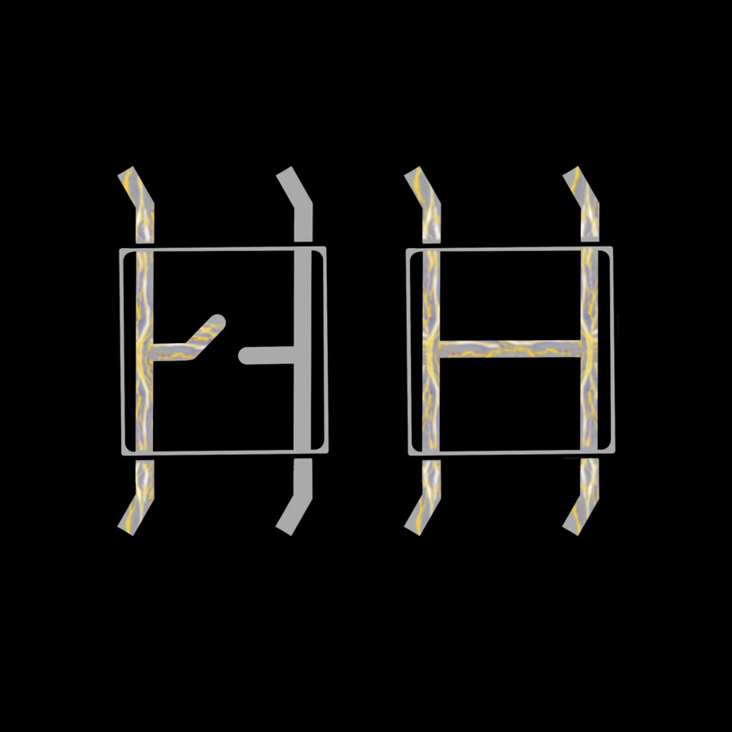

# Buttons


A push button is your first **input**: instead of the code controlling the
hardware, the hardware tells the code what's happening. You'll learn how the
ESP32 reads a pin, why buttons "bounce", and how to package code into a
module you can reuse in every project.

<div class="cc-parts" markdown>
**You'll need:**

- [x] 1 × push button
- [x] The LED and resistor from the [LEDs](leds.md) lesson
- [x] 2 × jumper wires
</div>

## Hardware

{ width="320" align=right }

A push button has four legs, joined in two pairs. Pushing the button down
connects the pairs, so electricity can flow through. Let go, and the
connection opens again.

The simplest way to use one is to connect one leg to a GPIO pin and a leg on
the **other side** of the button to GND. Plug the button across the gap in
the middle of the breadboard so the pairs aren't shorted together.

### Wiring

| From | To |
|---|---|
| ESP32 **GPIO 14** | One leg of the button |
| Button leg on the **opposite side** | ESP32 **GND** |

Keep the LED from the last lesson plugged in on GPIO 27. You'll use it
shortly.

### Pull-up resistors

When the button isn't pressed, the pin isn't connected to anything. A pin
like that is "floating" and reads random 0s and 1s. To fix this, we switch
on the ESP32's built-in **pull-up resistor**, which gently pulls the pin up
to 3.3 V:

- **Not pressed:** the pull-up holds the pin at 3.3 V, so it reads **1**.
- **Pressed:** the button connects the pin straight to GND, so it reads **0**.

That might feel backwards: pressed is 0! It's the most common way to wire
buttons, so you'll get used to it.

!!! note
    GPIO 34–39 don't have pull-up resistors, so don't use them for buttons.

## Software

### Reading the pin

```python title="button_basic.py"
--8<-- "lessons/button_basic.py"
```

- `Pin(BUTTON_PIN, Pin.IN, Pin.PULL_UP)` sets the pin up as an **input**
  with the pull-up resistor switched on.
- `button.value()` reads the pin: `1` or `0`.

Run it and hold the button down. The stream of 1s should turn into 0s.

### Debouncing

Say you want to count presses. The obvious idea is "if the pin changed to 0,
add one". But when the metal contacts inside the button touch, they bounce
against each other for a few milliseconds. To a fast microcontroller, one
press can look like five!

The fix is called **debouncing**: once we see a change, we ignore the button
for a moment until it has settled.

```python title="button_debounce.py"
--8<-- "lessons/button_debounce.py"
```

- `last_value` remembers what the button read last time around the loop, so
  we only react when the value **changes**, not the whole time it's held.
- `time.sleep_ms(20)` waits 20 milliseconds after every change, which is
  long enough for the bouncing to stop.

Try removing the `sleep_ms` line and pressing the button a few times. You'll
probably see the count jump by more than one.

### A reusable Button module

Almost every project uses buttons, and copying the debounce code every time
gets messy (especially with three buttons!). So we've packaged it into a
**module**: a Python file that other programs can `import`.

1. Download [`button.py`](https://github.com/CircuitCoder-ngh/MicroPythonStarterGuide/blob/main/code/lib/button.py)
   (or copy it from the box below).
2. Save it onto your ESP32 as `button.py`. See
   [Saving Programs to the Board](../getting-started/saving-programs.md) if
   you need a reminder of how.

??? info "button.py"

    ```python title="button.py"
    --8<-- "lib/button.py"
    ```

This version is a little smarter than our first one. Instead of pausing the
whole program with `sleep_ms`, it notes the time of each change and only
trusts the reading once it has stayed the same for 30 ms. Your program never
has to stop and wait.

Now counting presses takes just a few lines:

```python title="button_module.py"
--8<-- "lessons/button_module.py"
```

The `Button` class gives you two methods:

| Method | Returns `True`… | Use it for… |
|---|---|---|
| `button.was_pressed()` | **once** for each press | Toggling things, counting, menus |
| `button.is_down()` | the whole time the button is **held** | "Hold to move" controls |

!!! tip "Keep your loop fast"
    The button is only checked when you call one of these methods. If your
    loop has a long `time.sleep()` in it, a quick press can slip by
    unnoticed. Keep sleeps short, or leave them out.

### Button + LED

Time to combine what you've learned. Each press should flip the LED between
on and off. Try writing it yourself first!

```python title="button_led_toggle.py"
--8<-- "lessons/button_led_toggle.py"
```

## Challenge

Make the LED light up **only while the button is held down**, but also
print "Pressed!" once each time it's pushed.

??? example "Show a solution"

    ```python title="button_hold.py"
    --8<-- "lessons/button_hold.py"
    ```

    `button.is_down()` returns `True` or `False`, and `led.value()` treats
    those just like `1` and `0`.

**Next up:** [Potentiometers](potentiometers.md), an input that gives you a
whole range of values instead of just on or off.
