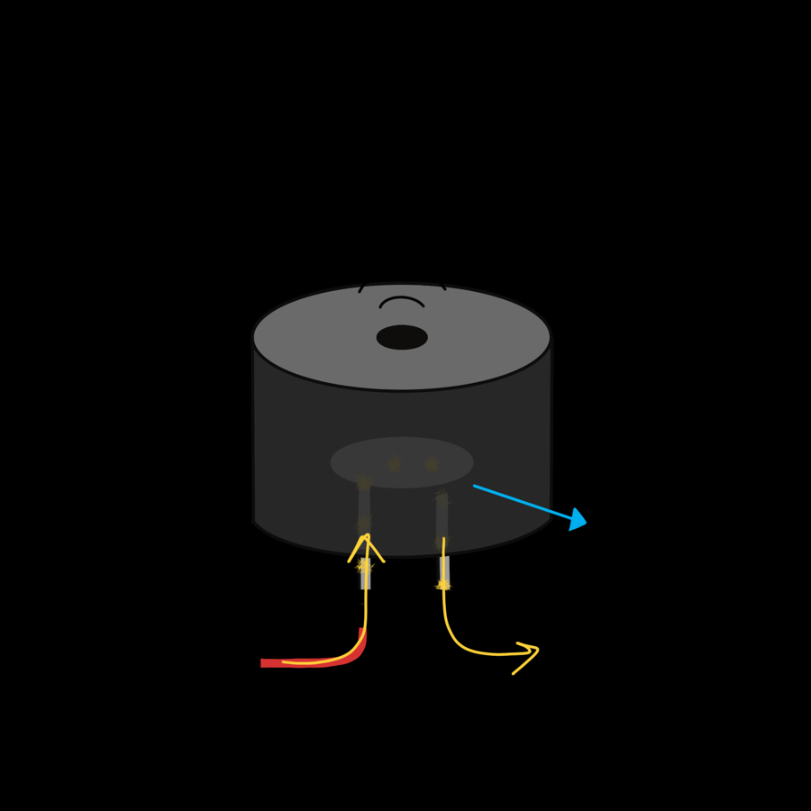

# Piezo Buzzers


A piezo buzzer turns electrical pulses into sound. Controlling one is your
introduction to **PWM** (pulse-width modulation), the same technique you'll
use for servo motors in the next lesson.

<div class="cc-parts" markdown>
**You'll need:**

- [x] 1 × passive piezo buzzer
- [x] 2 × jumper wires
</div>

## Hardware

{ width="320" align=right }

Inside the buzzer is a thin **piezo disc**, which flexes slightly every time
voltage is applied to it. Pulse it on and off hundreds of times a second and
the disc vibrates, pushing the air to make a sound.

### Wiring

| Buzzer leg | Connect to |
|---|---|
| **+** (usually the longer leg) | ESP32 **GPIO 26** |
| **–** | ESP32 **GND** |

If you can't hear anything once the code is running, try swapping the legs.

!!! note "Passive or active?"
    This lesson needs a **passive** buzzer, which plays whatever pitch you
    send it. An **active** buzzer has its own circuit inside and can only
    beep at one fixed pitch when switched on. Active buzzers usually have a
    sealed bottom and a sticker on top. If yours only ever makes the same
    tone, it's an active one.

## How PWM works

A PWM pin switches between on and off over and over. Two settings control
the signal:

- **Frequency** (`freq`): how many on/off cycles happen per second, in hertz
  (Hz). For a buzzer, this is the **pitch**. Higher frequency, higher note.
  The A above middle C is 440 Hz. Most buzzers sound best between about
  100 Hz and 5,000 Hz.
- **Duty cycle** (`duty_u16`): how much of each cycle the pin is **on**,
  from 0 (never) to 65535 (always). For a buzzer, this affects the
  **volume**:

| `duty_u16` | Duty | Sound |
|---|---|---|
| `0` | 0 % | Silent |
| `16384` | 25 % | Quieter |
| `32768` | 50 % | **Loudest** |
| `65535` | 100 % | Silent: the pin is just on, not pulsing |

The disc vibrates hardest when the on and off halves are equal, so **50 %
is the loudest**. Above 50 % it gets quieter again.

## Software

### Beep!

```python title="buzzer_beep.py"
--8<-- "lessons/buzzer_beep.py"
```

- `PWM(Pin(BUZZER_PIN), freq=1000, duty_u16=0)` turns the pin into a PWM
  output at 1,000 Hz, starting silent.
- `buzzer.duty_u16(32768)` starts the sound; `buzzer.duty_u16(0)` stops it.
- `buzzer.deinit()` switches PWM off when you're finished with the pin.

### Hearing the frequencies

This sweep plays every pitch from 100 Hz to 2,000 Hz. Watch the Shell to
find frequencies you like:

```python title="buzzer_scale.py"
--8<-- "lessons/buzzer_scale.py"
```

`range(100, 2000, 50)` counts from 100, going up by 50 each time, and stops
*before* 2000.

### Playing a tune

Every musical note has a frequency. A **dictionary** is a handy way to look
them up by name, and a **list** of `(note, beats)` pairs describes a song:

```python title="buzzer_melody.py"
--8<-- "lessons/buzzer_melody.py"
```

- `NOTES["G"]` looks up the frequency of G: 392 Hz.
- `for note, beats in SONG:` takes each pair apart into two variables.
- The short silence at the end of each note stops two of the same note from
  blurring into one long one.

Try writing your own song. Double a frequency and you get the same note one
octave higher, so `"C5": 523` is twice `"C": 262`.

!!! tip "Stopping a stuck tone"
    If you press **Stop** in the middle of a note, the buzzer can keep
    sounding. Type `from machine import Pin; Pin(26, Pin.OUT).off()` in the
    Shell, or press the board's **EN**/**RST** button.

## Challenge

Make a police-style **siren** that slides up and down in pitch, over and
over.

??? example "Show a solution"

    ```python title="buzzer_siren.py"
    --8<-- "lessons/buzzer_siren.py"
    ```

    `range(1500, 600, -20)` counts *down* because the step is negative.

**Next up:** Put buttons, potentiometers and buzzers together in the
[Music Machine](../projects/music-machine.md) project, or carry on to
[Servo Motors](servos.md).
