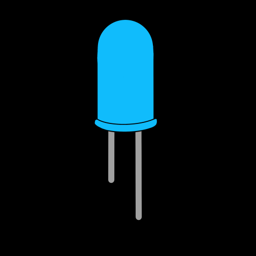
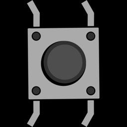
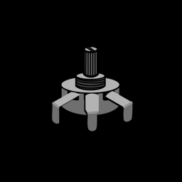
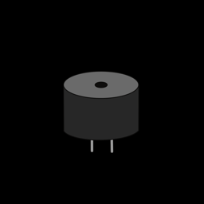
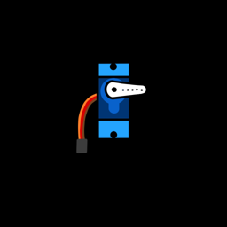
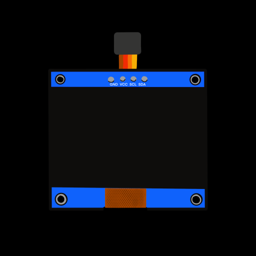
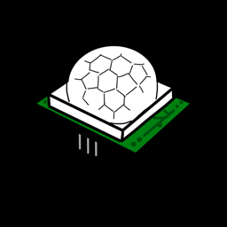

# Components

Each lesson in this section introduces one part: how it works, how to wire
it up, and the code to control it. Every lesson ends with a challenge to try
on your own. Work through them in order the first time, because later
lessons build on earlier ones.

  <a href="leds/">LEDs</a>
  <a href="buttons/">Buttons</a>
  <a href="potentiometers/">Potentiometers</a>
  <a href="buzzers/">Piezo Buzzers</a>
  <a href="servos/">Servo Motors</a>
  <a href="oled/">OLED Screens</a>
  <a href="motion-sensors/">Motion Sensors</a>
  <a href="wifi/">Wi-Fi & APIs</a>

## Inputs and outputs

Every component either gives the ESP32 information (an **input**) or does
something the ESP32 tells it to (an **output**). How the information travels
along the wire comes in a few flavours:

| Type | How it works | Components |
|---|---|---|
| **Digital input** | The pin reads either 0 (0 V) or 1 (3.3 V). | [Buttons](buttons.md), [Motion Sensors](motion-sensors.md) |
| **Analog input** | An ADC pin measures a voltage anywhere from 0 to 3.3 V and turns it into a number. | [Potentiometers](potentiometers.md) |
| **Digital output** | The pin is switched fully on (3.3 V) or off (0 V). | [LEDs](leds.md) |
| **PWM output** | The pin switches on and off very fast. The speed (frequency) and the on-time (duty cycle) carry the meaning. | [Piezo Buzzers](buzzers.md), [Servo Motors](servos.md), dimming LEDs |
| **I2C** | Two wires carry data back and forth, so one device can receive lots of detailed commands. | [OLED Screens](oled.md) |
| **Wi-Fi** | No wires at all: data travels over the network to and from the internet. | [Wi-Fi & APIs](wifi.md) |

Once you know which type a new part uses, you already know most of what you
need to control it. A light sensor is an analog input just like a
potentiometer. A motor driver takes PWM just like a buzzer.

## The pin plan

All lessons and projects use the same pins, so you can leave parts plugged
in as you go. The full list is on the [ESP32 Pins](../reference/esp32-pins.md)
page. Keep it open in a tab while you build!

!!! tip "Before you start"
    Make sure you've finished [Getting Started](../getting-started/index.md),
    so Thonny is installed and MicroPython is on your board.
