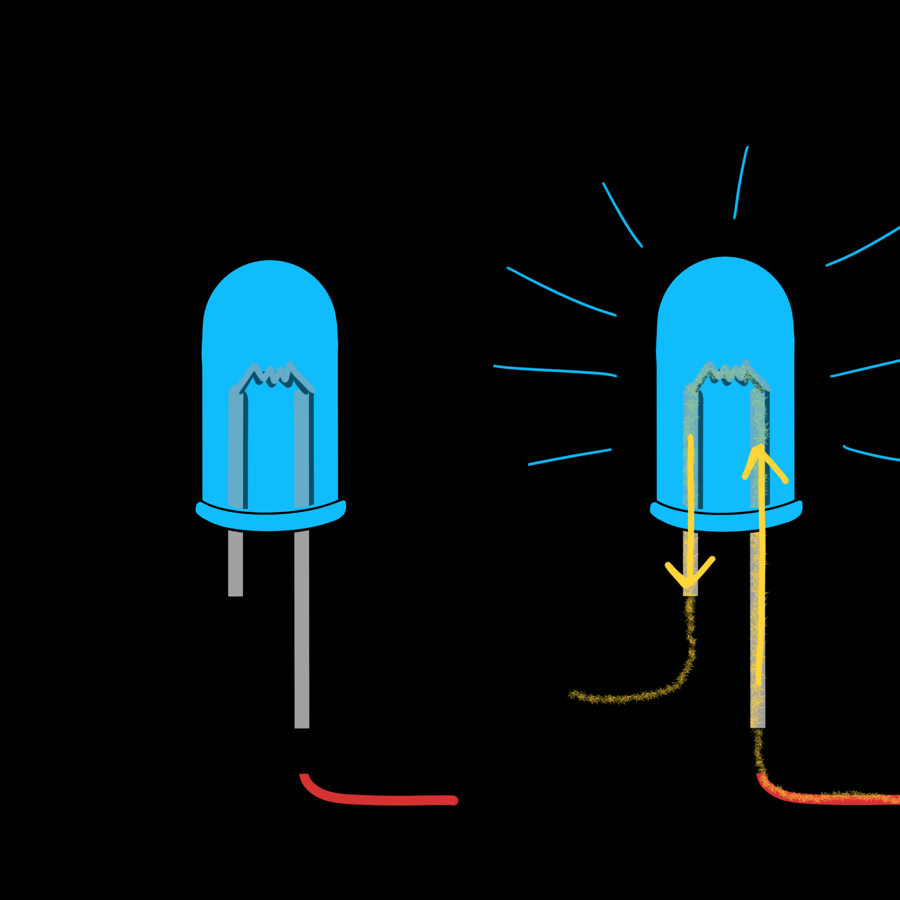

# LEDs


An LED (**light-emitting diode**) is the "hello world" of electronics. It's
an **output**: your code switches it on and off. Along the way you'll learn
how a GPIO pin sends out power, and why every LED needs a resistor.

<div class="cc-parts" markdown>
**You'll need:**

- [x] 1 × LED (any colour)
- [x] 1 × 220 Ω or 330 Ω resistor
- [x] 2 × jumper wires
</div>

## Start with the built-in LED

Most ESP32 boards have a tiny LED already soldered on and wired to GPIO 2, so
you can blink something before you plug in any parts. Open a new file in
Thonny, paste this in, and click **Run** (++f5++):

```python title="led_builtin_blink.py"
--8<-- "lessons/led_builtin_blink.py"
```

The small blue light on your board should blink once a second. Click
**Stop** (++ctrl+f2++) when you've seen enough.

!!! tip "No blinking?"
    A few boards don't have an LED on GPIO 2. If yours doesn't blink but
    Thonny shows no error, your code is fine. Move on to the external LED
    below.

## Hardware

{ width="320" align=right }

Diodes only let current flow **one way**, so an LED has to be plugged in the
right way round:

- The **long leg** (the *anode*, +) connects towards the GPIO pin.
- The **short leg** (the *cathode*, –) connects to **GND**. The rim of the
  LED usually has a flat edge on this side too.

When the pin is switched on, it puts out 3.3 V. Current flows through the
LED to ground, and the LED lights up.

### Why the resistor matters

An LED on its own has almost no resistance, so it would try to pull far more
current than an ESP32 pin can safely give. That can burn out the LED or
damage the pin. A **220–330 Ω resistor** in series limits the current to a
safe 5–10 mA, which is still plenty bright. It doesn't matter which leg of
the LED the resistor is on, or which way round the resistor goes.

### Wiring

| From | To |
|---|---|
| ESP32 **GPIO 27** | Resistor (either end) |
| Resistor (other end) | LED **long leg** |
| LED **short leg** | ESP32 **GND** |

!!! warning "Always use a resistor"
    Some older tutorials (including the first edition of this guide) wire
    an LED straight to a pin. It often *seems* to work, but it overloads the
    pin and shortens the life of both parts.

## Software

The code for an external LED is exactly the same, except for the pin number.
It's good practice to put pin numbers in a CAPITALISED variable at the top of
the file, so they're easy to find and change later.

```python title="led_blink.py"
--8<-- "lessons/led_blink.py"
```

Here's what each part does:

- `from machine import Pin`: the `machine` module comes built into
  MicroPython and is how your code talks to the hardware.
- `Pin(LED_PIN, Pin.OUT)` sets GPIO 27 up as an **output**.
- `led.on()` and `led.off()` switch the pin between 3.3 V and 0 V.
- `while True:` repeats the indented code forever, until you press Stop.

### Try it in the REPL

The **Shell** panel at the bottom of Thonny is a *REPL* (read-evaluate-print
loop). Anything you type there runs on the ESP32 straight away, which makes
it great for quick experiments. Type these lines one at a time and watch the
LED:

```pycon
>>> from machine import Pin
>>> led = Pin(27, Pin.OUT)
>>> led.on()
>>> led.off()
>>> led.value()
0
```

`led.value()` tells you what the pin is currently set to: `1` for on, `0`
for off.

## Challenge

Can you make the LED blink faster and faster? Try writing it yourself
first, then compare with this version:

??? example "Show a solution"

    ```python title="led_toggle.py"
    --8<-- "lessons/led_toggle.py"
    ```

    `led.value(not led.value())` reads the LED's current state and sets it
    to the opposite, so the same line turns it on *and* off.

**Next up:** [Buttons](buttons.md), your first **input**.
