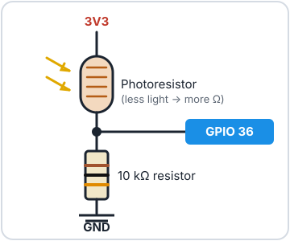

# Light Sensors


A **photoresistor** (also called an **LDR**, a light-dependent resistor) is
a resistor that changes with light. In the dark it resists a lot; in bright
light it hardly resists at all. Paired with an ordinary resistor, it becomes
an **analog input**, just like a potentiometer, except the "knob" is turned
by the light in the room.

<div class="cc-parts" markdown>
**You'll need:**

- [x] 1 × photoresistor (e.g. GL5528)
- [x] 1 × 10 kΩ resistor (brown, black, orange)
- [x] 3 × jumper wires
- [x] The LED from the [LEDs](leds.md) lesson (for the night light example)
</div>

## Hardware

{ width="320" align=right }

The ESP32 can't measure resistance directly, only **voltage**. So we build a
**voltage divider**: the photoresistor and a fixed 10 kΩ resistor in a
chain between 3V3 and GND, with the ESP32 measuring the voltage at the point
where they join.

Think of the two resistors as having a tug-of-war over that middle point:

- **Bright light:** the photoresistor's resistance drops, 3V3 wins the
  tug-of-war, and the voltage at the pin goes **up**.
- **Darkness:** the photoresistor's resistance rises, GND wins, and the
  voltage goes **down**.

### Wiring

| From | To |
|---|---|
| ESP32 **3V3** | One leg of the photoresistor (either way round) |
| Other leg of the photoresistor | ESP32 **GPIO 36** (often labelled **VP**) |
| ESP32 **GPIO 36** | One end of the 10 kΩ resistor |
| Other end of the 10 kΩ resistor | ESP32 **GND** |

In practice, plug the photoresistor and the resistor into the same
breadboard row, then run one wire from that row to GPIO 36.

## Software

Reading the sensor works exactly like reading a
[potentiometer](potentiometers.md):

```python title="ldr_read.py"
--8<-- "lessons/ldr_read.py"
```

Run it, then cover the sensor with your hand and shine your phone's torch on
it. Watch how far the numbers move.

- `ADC(Pin(LDR_PIN), atten=ADC.ATTN_11DB)` sets up GPIO 36 to measure the
  full 0–3.3 V range.
- `read_u16()` gives 0–65535. **Bigger means brighter.**

!!! tip "Try it in the REPL"
    ```pycon
    >>> from machine import ADC, Pin
    >>> ldr = ADC(Pin(36), atten=ADC.ATTN_11DB)
    >>> ldr.read_u16()
    23417
    ```
    Run the last line a few times with your hand over the sensor, and a few
    times without.

### Calibrating

Every room is different: your readings might only swing between 8,000 and
40,000. **Calibrating** means measuring the darkest and brightest values
first, then scaling everything to fit between them:

```python title="ldr_calibrate.py"
--8<-- "lessons/ldr_calibrate.py"
```

- During the first 5 seconds, `min()` and `max()` keep track of the
  darkest and brightest readings seen so far.
- After that, each reading is scaled so the darkest value becomes 0 % and the
  brightest becomes 100 %. Readings outside that range are clamped.

### An automatic night light

Now make a decision based on the light: switch the LED on GPIO 27 on when
it gets dark.

```python title="ldr_night_light.py"
--8<-- "lessons/ldr_night_light.py"
```

Use `ldr_read.py` to see what your room reads with the lights on and off,
then set `DARK_BELOW` somewhere between the two.

## Challenge

The night light flickers if the light level hovers right around
`DARK_BELOW`. Fix it by using **two** thresholds: turn the LED on below one
value, but only turn it off again above a higher one.

??? example "Show a hint"

    Keep the LED's current state in mind:

    ```python
    if led.value() == 0 and reading < 15000:
        led.on()
    elif led.value() == 1 and reading > 20000:
        led.off()
    ```

    The gap between the two numbers is called **hysteresis**. Your home
    thermostat uses the same trick so the heating doesn't click on and off
    every few seconds.

**Next up:** [Temperature & Humidity](temperature.md): measure the weather
indoors.
