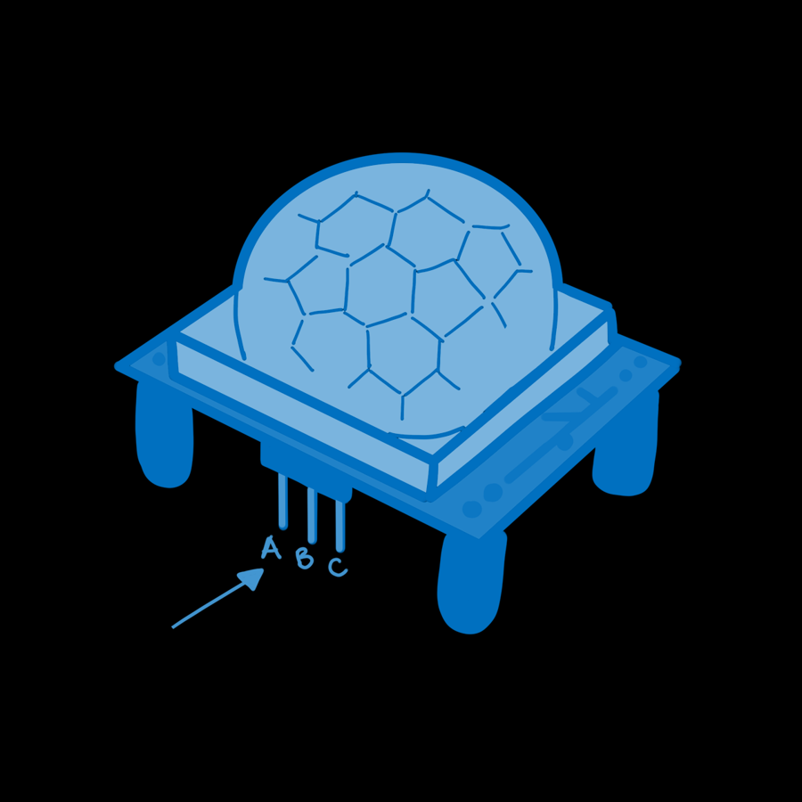
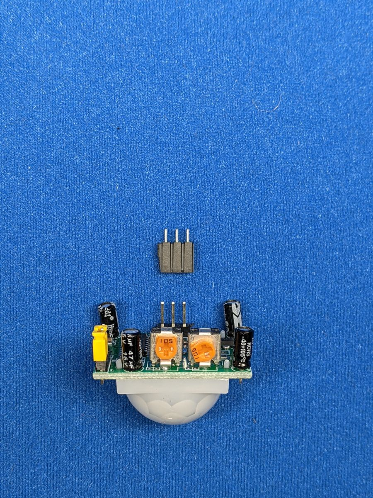
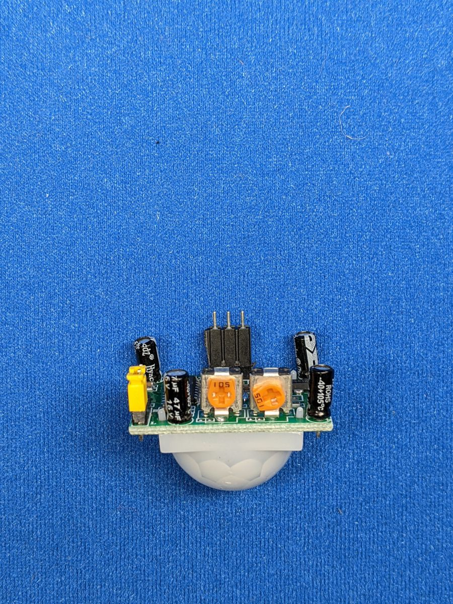
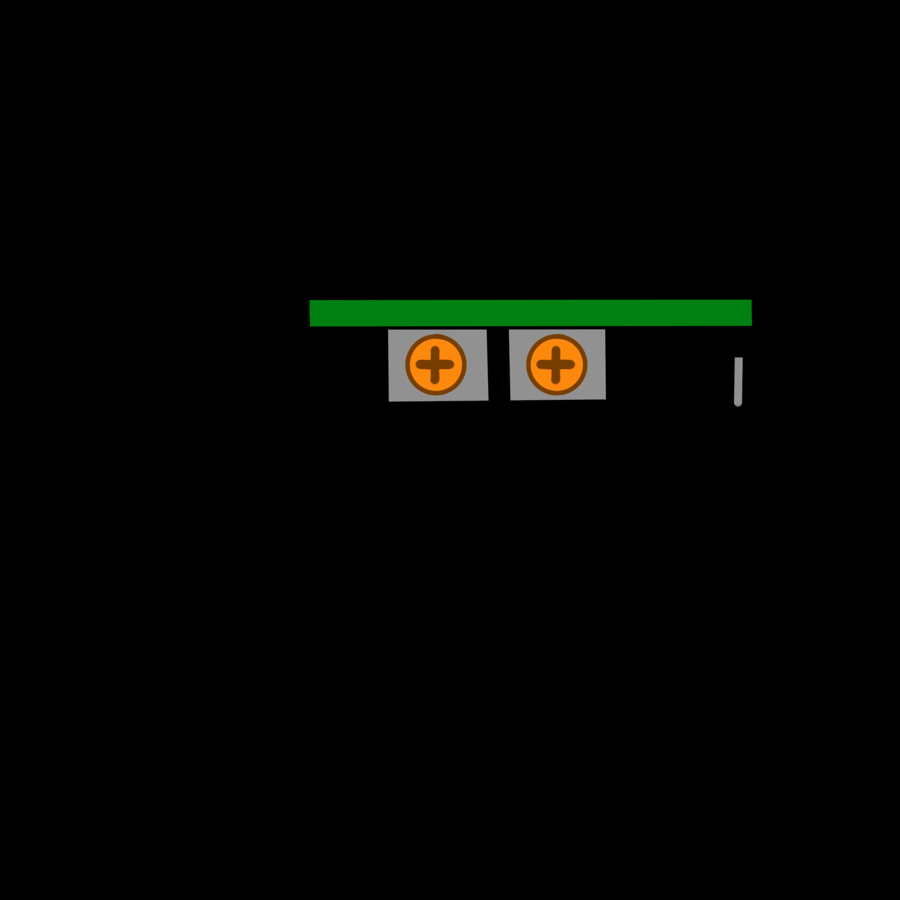

# Motion Sensors


A **PIR** (passive infrared) sensor notices when something warm, like a
person or a pet, moves in front of it. It's what switches on automatic
lights, and it's a **digital input** just like a button: 1 when it sees
motion, 0 when it doesn't.

<div class="cc-parts" markdown>
**You'll need:**

- [x] 1 × HC-SR501 PIR motion sensor
- [x] 3 × jumper wires (female-to-male are handiest)
- [x] The LED and resistor from the [LEDs](leds.md) lesson
- [x] The buzzer from the [Piezo Buzzers](buzzers.md) lesson (for the challenge)
</div>

## Hardware

Everything warm gives off invisible infrared light. The white dome is a lens
that focuses infrared from the room onto a sensor behind it. When the
pattern of heat changes, because something warm moved, the sensor sets its
output pin HIGH.

### Pins

{ width="300" align=right }

| Pin | Name | Connect to |
|---|---|---|
| A | **GND** | ESP32 **GND** |
| B | **OUT** (output) | ESP32 **GPIO 33** |
| C | **VCC** (power) | ESP32 **VIN** (5 V) |

The sensor needs about 5 V to run, so it's powered from VIN. Its output
signal is only 3.3 V though, which is safe for the ESP32's pins.

!!! tip "Check the labels"
    The pin names are printed on the circuit board, hidden under the white
    dome. The dome pulls straight off, so if your sensor looks different
    from the diagram, take a peek and put it back on afterwards.

If your sensor came with a loose 3-pin header, fit it into the three holes
(some sensors need it soldered in) so you can plug in jumper wires:

<div class="cc-gallery" markdown>


</div>

### The two dials

{ width="300" align=right }

On the side are two small orange dials you can turn with a screwdriver:

- **Time delay** (often labelled **Tx**): how long the output stays at 1
  after motion is detected, from about 3 seconds up to a few minutes. Turn
  it all the way down (anticlockwise) for this lesson.
- **Sensitivity** (often labelled **Sx**): how far away it can see, from
  roughly 3 m to 7 m.

Many sensors also have a small **jumper** with two positions. In **H**
(repeat trigger), the output stays on for as long as there's movement. In
**L** (single trigger), it turns off after the delay even if you're still
moving. H is the one you'll usually want.

## Software

```python title="pir_basic.py"
--8<-- "lessons/pir_basic.py"
```

- `Pin(PIR_PIN, Pin.IN)` sets up an input **without** a pull-up resistor.
  Unlike a button, the sensor actively drives its output to 0 or 1 itself.
- `led.value(pir.value())` copies the sensor's reading straight onto the
  LED.

!!! note "Give it a minute"
    After power-up, a PIR sensor needs **30–60 seconds** to learn what the
    room looks like. It may trigger randomly during that time. It also
    ignores new motion for a couple of seconds after its output switches
    off.

### Reacting when motion starts

Usually you want to do something *once* when motion begins, such as sending
an alert, rather than the whole time it's happening. It's the same trick as
the button lesson: remember the last reading and look for a **change**:

```python title="pir_events.py"
--8<-- "lessons/pir_events.py"
```

No debouncing is needed here: the sensor's output is already clean.

## Challenge

Build a mini intruder alarm: each time motion **starts**, flash the LED and
chirp the buzzer (GPIO 26) three times.

??? example "Show a solution"

    ```python title="pir_alarm.py"
    --8<-- "lessons/pir_alarm.py"
    ```

    Want the alarm to message your phone instead? That's the
    [Motion Alert](../projects/motion-alert.md) project.

**Next up:** [Wi-Fi & APIs](wifi.md).
