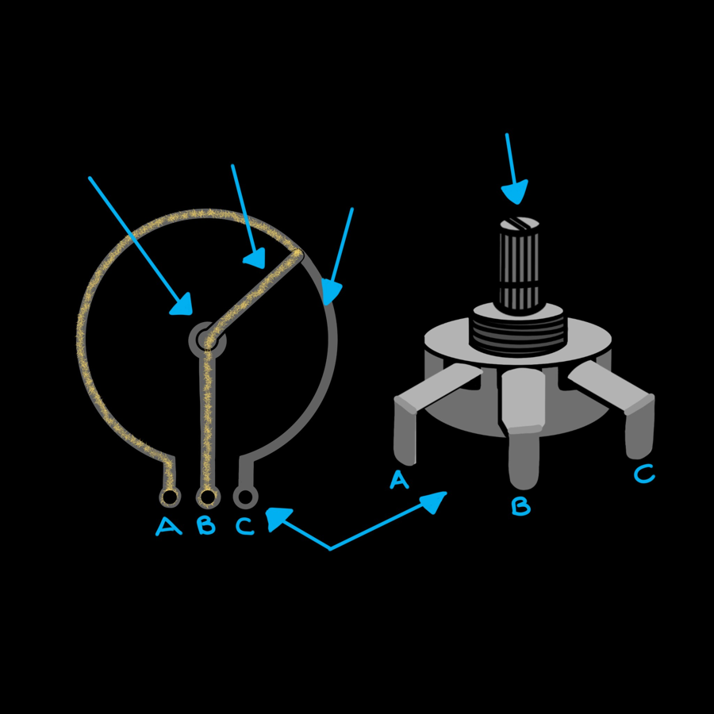

# Potentiometers


A button is either pressed or not. A **potentiometer** (a "pot") is a knob
that gives you everything in between. It's an **analog input**, and it's
perfect for volume controls, steering, or anything you want to adjust
smoothly.

<div class="cc-parts" markdown>
**You'll need:**

- [x] 1 × 10 kΩ potentiometer
- [x] 3 × jumper wires
- [x] The LED and resistor from the [LEDs](leds.md) lesson (for the challenge)
</div>

## Hardware

{ width="340" align=right }

Inside a potentiometer is a curved strip of resistive material (the
**track**) with a leg at each end. A third, middle leg is connected to a
**wiper** that slides along the track as you turn the knob.

Put 3.3 V across the two outer legs, and the wiper picks off a voltage
somewhere in between: near 0 V at one end of the turn, near 3.3 V at the
other, and about 1.65 V halfway. The ESP32 measures that voltage.

### Wiring

| Potentiometer leg | Connect to |
|---|---|
| Outer leg **A** | ESP32 **3V3** |
| Middle leg **B** (wiper) | ESP32 **GPIO 34** |
| Outer leg **C** | ESP32 **GND** |

If turning the knob clockwise makes the number go *down*, just swap the two
outer legs.

!!! warning "Use 3V3, not VIN"
    The ESP32's input pins can only handle up to 3.3 V. Connecting the
    potentiometer to the 5 V VIN pin could damage the board.

## Software

Reading a voltage needs an **ADC** (analog-to-digital converter) pin. It
turns the voltage into a number your code can use.

```python title="pot_read.py"
--8<-- "lessons/pot_read.py"
```

- `ADC(Pin(POT_PIN), atten=ADC.ATTN_11DB)` creates the ADC. On its own the
  ESP32's ADC can only measure up to about 1 V. The `ATTN_11DB`
  *attenuation* setting scales the input down so the full 0–3.3 V range fits.
- `pot.read_u16()` returns a number from **0** (0 V) to **65535** (3.3 V).
  That's the same range whichever MicroPython board you use.
- `raw * 100 // 65535` scales that to a percentage. `//` divides and throws
  away the remainder, so you get a whole number.

!!! note "Which pins can read analog?"
    Only GPIO **32–39** (called ADC1) work reliably. The other ADC pins
    (ADC2) stop working as soon as Wi-Fi is switched on, so this guide
    always uses 34 and 35 for potentiometers. See the
    [ESP32 Pins](../reference/esp32-pins.md) page.

### Smoothing out the jitter

You'll notice the number wobbles a little even when you're not touching the
knob. That's normal: the ESP32's ADC is a bit noisy. Averaging several
readings together steadies it:

```python title="pot_smooth.py"
--8<-- "lessons/pot_smooth.py"
```

The ESP32 is also less accurate at the very ends of the range, so don't
worry if the reading never quite reaches exactly 0 or 100 %.

!!! tip "Measuring real volts"
    `pot.read_uv()` returns a calibrated reading in microvolts (millionths
    of a volt). Divide by 1,000,000 to get volts. Try it in the Shell:
    `pot.read_uv() / 1_000_000`.

## Challenge

Use the potentiometer as a **dimmer switch** for the LED on GPIO 27.

Hint: an LED can't be "half on", but it *can* be switched on and off so fast
that it looks dimmer. That's called **PWM**, and you create it with
`PWM(Pin(27), freq=1000, duty_u16=0)`. Then `led.duty_u16(value)` sets how
much of the time it's on, from 0 to 65535. That's the same range as
`read_u16()`!

??? example "Show a solution"

    ```python title="pot_led_brightness.py"
    --8<-- "lessons/pot_led_brightness.py"
    ```

    You'll learn much more about PWM in the next lesson.

**Next up:** [Piezo Buzzers](buzzers.md). Time to make some noise.
