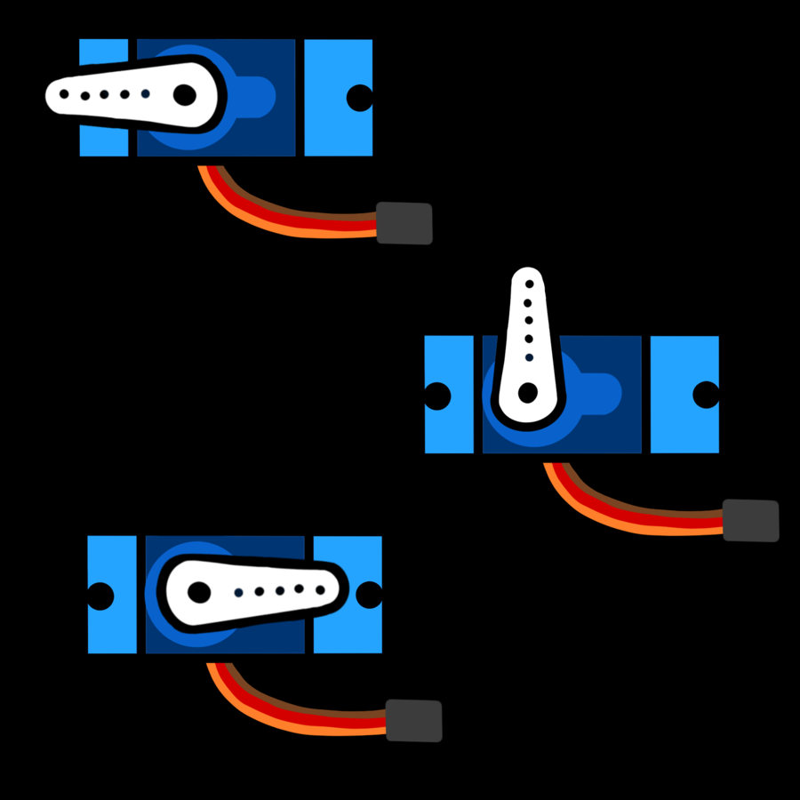

# Servo Motors


A servo is a small motor that can turn to an exact angle and hold it there.
Servos steer RC cars, move robot arms and flick switches. You control one
with PWM, like the buzzer, but this time the **length of each pulse** sets
the angle.

<div class="cc-parts" markdown>
**You'll need:**

- [x] 1 × SG90-style micro servo (or similar)
- [x] 3 × jumper wires
- [x] A push button (for the challenge)
</div>

## Hardware

A servo has three wires. The colours vary between brands:

| Servo wire | Usual colour | Connect to |
|---|---|---|
| Power | Red | ESP32 **VIN** (5 V from USB) |
| Ground | Brown or black | ESP32 **GND** |
| Signal | Orange, yellow or white | ESP32 **GPIO 13** |

!!! warning "Power from VIN, not 3V3"
    Motors draw a lot of current when they move. Powering the servo from
    VIN takes that current straight from USB, rather than through the
    ESP32's 3.3 V regulator. One small servo is fine this way. For bigger
    servos, or several at once, use a separate 5 V supply and connect its
    ground to the ESP32's GND.

## How a servo reads PWM

{ width="340" align=right }

A servo expects a pulse **50 times a second** (50 Hz), which is one every
20 milliseconds. The length of each pulse tells it where to point:

| Pulse length | Angle |
|---|---|
| 0.5 ms | 0° |
| 1.5 ms | 90° (middle) |
| 2.5 ms | 180° |

Instead of working out a duty cycle, MicroPython lets you set the pulse
length directly with `duty_ns()`, in nanoseconds (billionths of a second).
1 ms is 1,000,000 ns.

## Software

```python title="servo_sweep.py"
--8<-- "lessons/servo_sweep.py"
```

- `PWM(Pin(SERVO_PIN), freq=50, duty_u16=0)` sets up 50 Hz pulses, starting
  with no signal so the servo doesn't jump anywhere.
- `set_angle()` does the maths once, so the rest of your code can think in
  degrees. At 90°, it works out `500_000 + 2_000_000 * 90 // 180 = 1_500_000`
  ns: 1.5 ms, the middle.
- `max(0, min(180, angle))` clamps the angle, so a typo like
  `set_angle(1800)` can't push the servo past its limits.
- `servo.duty_u16(0)` stops the pulses. The servo relaxes and can be turned
  by hand. Keep sending pulses if you need it to *hold* its position against
  a force.

(You can write big numbers like `2_500_000` with underscores to make them
easier to read. Python ignores the underscores.)

### Calibrating your servo

Every servo model is a little different. If yours buzzes or strains at 0° or
180°, it's being asked to go further than it can. Run this sweep and watch
where the horn **stops moving** at each end:

```python title="servo_calibrate.py"
--8<-- "lessons/servo_calibrate.py"
```

Then put those two values into `SERVO_MIN_NS` and `SERVO_MAX_NS` in your
programs. Many SG90s are happiest at about 600,000–2,400,000 ns.

!!! note "Continuous-rotation servos"
    Some servos look identical but are labelled **360°** or **continuous**
    (for example the FS90R). They spin like a wheel instead of pointing to
    an angle: a 1.5 ms pulse means *stop*, shorter pulses spin one way and
    longer pulses spin the other, faster the further from 1.5 ms you go.
    If your servo keeps spinning during the sweep, that's what you have.

## Challenge

Using the [`Button`](buttons.md#a-reusable-button-module) module, make each
press of Button A (GPIO 14) move the servo to the next position in the list
`[0, 45, 90, 135, 180]`, looping back to 0 at the end.

??? example "Show a solution"

    ```python title="servo_button_positions.py"
    --8<-- "lessons/servo_button_positions.py"
    ```

    `%` gives the remainder after dividing, so `(4 + 1) % 5` is `0`. It's a
    neat trick for wrapping a counter back to the start.

**Next up:** Control a servo with a knob or buttons in the
[Servo Controller](../projects/servo-controller.md) project, or carry on to
[OLED Screens](oled.md).
