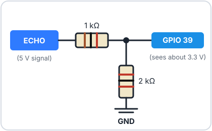

# Ultrasonic Sensors


The **HC-SR04** ultrasonic sensor measures distance the way bats and
submarines do: it sends out a "ping" of sound, far too high-pitched for you
to hear, and listens for the echo. The longer the echo takes to come back,
the further away the object is. It's the sensor that lets the
[robot](../robot/index.md) see where it's going.

<div class="cc-parts" markdown>
**You'll need:**

- [x] 1 × HC-SR04**P** ultrasonic sensor (the 3.3 V-friendly version), or a
  classic HC-SR04
- [x] 4 × jumper wires
- [x] For a classic 5 V HC-SR04 only: 1 × 1 kΩ and 1 × 2 kΩ resistor
- [x] The RGB LED from the [RGB LEDs](rgb-led.md) lesson (for the challenge)
</div>

## Hardware

The two silver cylinders are a tiny **speaker** (the transmitter, marked
**T**) and a **microphone** (the receiver, marked **R**). Here's what
happens when you take a measurement:

1. The ESP32 sends a short pulse to the **TRIG** pin.
2. The sensor fires eight quick clicks of 40 kHz sound (about twice as high
   as the highest note a human can hear).
3. The sensor sets its **ECHO** pin high, and keeps it high until the echo
   comes back.
4. The ESP32 times how long ECHO stayed high. Sound travels about 343 metres
   per second, so the time tells us the distance.

### Which sensor do you have?

The classic **HC-SR04** runs on **5 V**, and its ECHO pin sends back a 5 V
signal. That's too much for the ESP32, whose pins can only take 3.3 V. The
newer **HC-SR04P** (and the similar **RCWL-1601**) look almost the same but
happily run on 3.3 V. Check the listing, or look for a "P" or "3.3–5 V" on
the back of the board.

=== "HC-SR04P (3.3 V)"

    | Sensor pin | Connect to |
    |---|---|
    | **VCC** | ESP32 **3V3** |
    | **Trig** | ESP32 **GPIO 5** |
    | **Echo** | ESP32 **GPIO 39** (often labelled **VN**) |
    | **GND** | ESP32 **GND** |

=== "Classic HC-SR04 (5 V)"

    { width="380" }

    | Sensor pin | Connect to |
    |---|---|
    | **VCC** | ESP32 **VIN** (5 V) |
    | **Trig** | ESP32 **GPIO 5** (3.3 V is enough to trigger it) |
    | **Echo** | **1 kΩ** resistor → ESP32 **GPIO 39**, plus a **2 kΩ** resistor from GPIO 39 to **GND** |
    | **GND** | ESP32 **GND** |

    The two resistors form a **voltage divider**, like the one in the
    [Light Sensors](light-sensors.md) lesson. It shrinks ECHO's 5 V down to
    about 3.3 V before it reaches the ESP32.

    !!! danger "Don't skip the divider"
        Connecting a 5 V ECHO pin straight to the ESP32 can damage the pin
        over time.

GPIO 39 is **input-only**, which is fine here: the ESP32 only ever listens to
ECHO.

## Software

### How it works, step by step

```python title="ultrasonic_raw.py"
--8<-- "lessons/ultrasonic_raw.py"
```

- `trigger.value(1)`, `time.sleep_us(10)`, `trigger.value(0)` sends the
  10-**micro**second (millionths of a second) pulse that starts a
  measurement.
- `time_pulse_us(echo, 1, 30000)` waits for ECHO to go high (`1`) and returns
  how many microseconds it stayed high. If nothing comes back within 30,000
  µs, it gives up and returns a negative number.
- Sound travels **0.0343 cm per microsecond**. The time covers the trip
  **there and back**, so we divide by 2.

Point the sensor at a wall and move it closer and further away. Hold a book
in front of it, then a cushion. Soft or sloping surfaces soak up or deflect
the sound, so the readings get unreliable.

!!! info "What it can and can't see"
    The HC-SR04 works best from about **2 cm to 2.5 m**, on hard, flat
    surfaces facing it head-on. It sees in a cone about 30° wide, so it will
    spot things slightly to the side, too.

### The DistanceSensor module

The robot and several projects use this sensor, so we've wrapped it in a
module, just like `button.py`:

1. Download [`distance.py`](https://github.com/CircuitCoder-ngh/MicroPythonStarterGuide/blob/main/code/lib/distance.py)
   (or copy it from the box below).
2. Save it onto your ESP32 as `distance.py`. See
   [Saving Programs to the Board](../getting-started/saving-programs.md) if
   you need a reminder.

??? info "distance.py"

    ```python title="distance.py"
    --8<-- "lib/distance.py"
    ```

It does the same thing as the step-by-step version, plus one extra: it makes
sure there's at least 60 ms between pings, so the sensor never mistakes the
echo of an old ping for a new one.

```python title="ultrasonic_library.py"
--8<-- "lessons/ultrasonic_library.py"
```

- `DistanceSensor(trigger_pin=5, echo_pin=39)` sets up both pins for you.
- `distance_cm()` returns the distance in centimetres, or `None` if nothing
  was in range. `None` is Python's way of saying "no value", and
  `if cm is None:` checks for it.

## Challenge

Build a traffic-light distance meter with the RGB LED: **green** when
nothing is close, **yellow** under 50 cm, and **red** under 20 cm.

??? example "Show a solution"

    ```python title="ultrasonic_led_meter.py"
    --8<-- "lessons/ultrasonic_led_meter.py"
    ```

    This is the start of the [Parking Sensor](../projects/parking-sensor.md)
    project, which adds a beeper that speeds up as you get closer.

**Next up:** You've met every component. Time to build something with them:
head to the [Projects](../projects/index.md).
