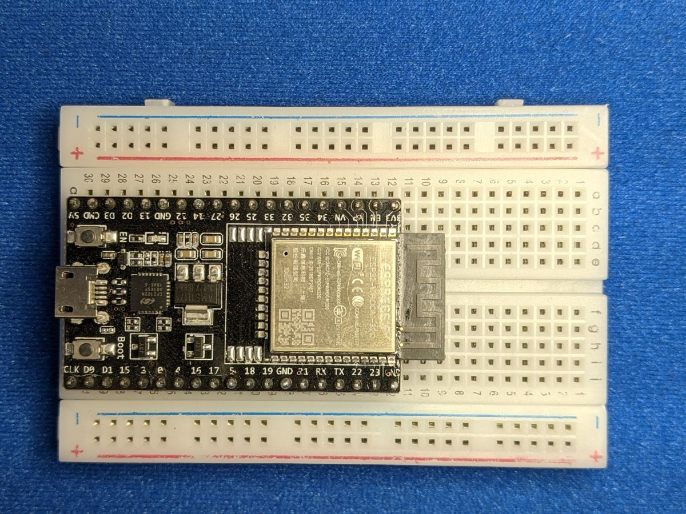

# What You Need

## The board

This guide uses an **ESP32 DevKit** board: the common kind with an
**ESP32-WROOM-32** module (the silver rectangle) and 30 or 38 pins. They're
sold under many names ("ESP32 DevKitC", "ESP32-WROOM-32 development board",
"NodeMCU-32S") and cost a few dollars each.

!!! note "Other ESP32 boards"
    Newer chips such as the ESP32-S3 and ESP32-C3 also run MicroPython, but
    their pin numbers are different, so the wiring in this guide won't match.
    If you're buying a board, get a classic ESP32-WROOM-32 DevKit.

You'll also need a **USB cable that can carry data**. Many cheap cables only
carry power. If your computer doesn't notice the board when you plug it in,
try another cable first. Check whether your board has a **micro-USB** or
**USB-C** socket.

## The parts

The parts come in three groups, so you can start small and add more as you
go.

### Starter parts

Everything you need for the first eight component lessons and the original
projects.

| Part | Qty | Used in |
|---|:-:|---|
| ESP32 DevKit board | 1 | Everything |
| Solderless breadboard (830-hole) | 2 | Everything |
| Jumper wires (male-to-male) | ~30 | Everything |
| 5 mm LEDs | 2+ | LEDs, Motion Alert |
| 220 Ω or 330 Ω resistors | 5+ | LEDs, RGB LEDs, Motion Alert |
| 6 mm tactile push buttons | 3 | Buttons and most projects |
| 10 kΩ potentiometers | 2 | Potentiometers, Music Machine, Servo Controller, Etch-a-Sketch |
| Passive piezo buzzer | 1 | Buzzers, Music Machine, Alarm Clock, and more |
| SG90 micro servo motor | 1 | Servos, Servo Controller, Fortune Teller, Sonar Radar |
| SSD1306 0.96" OLED screen, 128×64, I2C (4 pins) | 1 | OLED, Etch-a-Sketch, Snake, Alarm Clock, and more |
| HC-SR501 PIR motion sensor | 1 | Motion Sensors, Motion Alert |
| A Wi-Fi network (2.4 GHz) | – | Wi-Fi, Motion Alert, Alarm Clock, Weather Station |

### Sensors & lights

Add these for the second set of lessons and their projects.

| Part | Qty | Used in |
|---|:-:|---|
| RGB LED, 5 mm, common cathode | 1 | RGB LEDs, Parking Sensor |
| Photoresistor (LDR, e.g. GL5528) | 1 | Light Sensors, Light Theremin, Night Light |
| 10 kΩ resistors | 2+ | Light Sensors |
| 1 kΩ and 2 kΩ resistors | 1 each | Only for a 5 V ultrasonic sensor |
| DHT11 temperature & humidity module (3-pin) | 1 | Temperature & Humidity, Weather Station |
| WS2812B NeoPixel ring or stick, 8 LEDs | 1 | NeoPixels, Night Light, Touch Piano |
| HC-SR04P ultrasonic distance sensor (3.3 V version) | 1 | Ultrasonic Sensors, Parking Sensor, Sonar Radar, Robot |
| Aluminium foil, coins or fruit | – | Touch Sensors, Touch Piano |

### Robot parts

Everything extra you need to build the [two-wheeled robot](../robot/index.md).
The [robot's overview page](../robot/index.md) explains each part.

| Part | Qty |
|---|:-:|
| 2WD robot car chassis kit (2 TT gear motors, wheels, caster, 4×AA holder with switch) | 1 |
| DRV8833 dual motor driver module | 1 |
| TCRT5000 line-tracking sensor modules | 2 |
| Half-size breadboard | 1 |
| Jumper wires (male-to-female) | ~10 |
| AA batteries (rechargeable NiMH are fine) | 4 |
| Small USB power bank and a short USB cable | 1 |

!!! tip "Buzzer: passive, not active"
    Piezo buzzers come in two types. A **passive** buzzer can play any
    note, which is what you want. An **active** buzzer can only beep at one
    pitch. They look almost identical, so check the listing when you buy.

## Setting up the breadboard

A breadboard lets you build circuits without soldering. Inside, the holes
are connected in rows: each numbered row of 5 holes (a–e, and f–j) is joined
together, and the long **+** and **–** rails along the edges run the whole
length of the board.

Press the ESP32 into the breadboard so that it straddles the centre channel
and the USB port hangs off one end. Be gentle: push evenly on both edges of
the board, not on the silver module.

{ .cc-photo }

Most ESP32 boards are so wide that only **one row of holes is left free** on
one side. That's fine for most lessons. When you need pins on both sides,
put two breadboards next to each other with the ESP32 bridging the gap:

{ .cc-photo }

!!! tip "Use the rails"
    Connect a **GND** pin to the **–** rail and the **3V3** pin to the
    **+** rail. Then any component can reach power or ground from anywhere
    on the board with one short wire.

## No hardware yet? Try a simulator

[Wokwi](https://wokwi.com/micropython) is a free online simulator that runs
MicroPython on a virtual ESP32, complete with LEDs, buttons, servos and OLED
screens. It's a great way to try the lessons before your parts arrive.

**Next:** [Install Thonny & MicroPython](setup.md)
