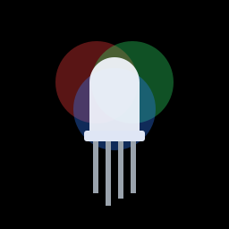
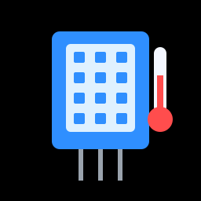
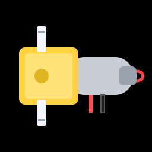
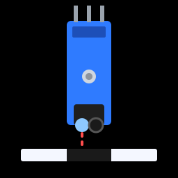

---
hide:
  - navigation
  - toc
---

# Learn electronics by building things that work.

CircuitCoder is a free, hands-on guide to programming microcontrollers. You'll
wire up real components to an **ESP32** board, write **MicroPython** code to
control them, and combine them into projects you'll actually want to show
people: a Snake game, a sonar radar, a Wi-Fi alarm clock, and finally a
**robot** that dodges obstacles and follows lines on its own.

No experience needed. If you can install an app and follow along, you can do this.

[Get started :material-arrow-right:](getting-started/index.md){ .md-button .md-button--primary }
[See the projects](projects/index.md){ .md-button }

## What you'll learn

Each component gets its own short lesson: how it works, how to wire it, and
the code to control it.

  <a href="components/leds/">LEDs</a>
  <a href="components/buttons/">Buttons</a>
  <a href="components/potentiometers/">Potentiometers</a>
  <a href="components/buzzers/">Buzzers</a>
  <a href="components/servos/">Servo Motors</a>
  <a href="components/oled/">OLED Screens</a>
  <a href="components/motion-sensors/">Motion Sensors</a>
  <a href="components/wifi/">Wi-Fi & APIs</a>
  <a href="components/rgb-led/">RGB LEDs</a>
  <a href="components/light-sensors/">Light Sensors</a>
  <a href="components/temperature/">Temperature</a>
  <a href="components/touch/">Touch Sensors</a>
  <a href="components/neopixels/">NeoPixels</a>
  <a href="components/ultrasonic/">Ultrasonic</a>
  <a href="robot/dc-motors/">DC Motors</a>
  <a href="robot/line-sensors/">Line Sensors</a>

## What you'll build

  
  
  
  

Thirteen projects, from a one-knob instrument to a Wi-Fi alarm clock:

- **Music Machine** and **Light Theremin**: play music with a knob, or by
  waving your hand over a light sensor.
- **Touch Piano**: turn coins, foil or bananas into piano keys.
- **Night Light**: a colour-changing lamp that switches itself on when it
  gets dark.
- **Etch-a-Sketch** and **Snake**: draw and play games on a tiny screen you
  wired up yourself.
- **Parking Sensor** and **Sonar Radar**: measure distance with sound, the
  way bats and submarines do.
- **Weather Station**, **Motion Alert** and **Alarm Clock**: connected
  gadgets that talk to the internet and to your phone.

[See all the projects](projects/index.md){ .md-button }

## Build a robot

The guide ends with its biggest build: a **two-wheeled robot** you wire and
program yourself. Step by step, you'll teach it to:

- drive in patterns and dance,
- **see** and dodge obstacles with an ultrasonic sensor,
- **follow a line** of tape around a track,
- and take orders from your **phone over Wi-Fi**.

Everything you've learned comes together here: inputs, outputs, motors,
sensors, and code that makes decisions on its own. That's mechatronics.

[Meet the robot :material-robot:](robot/index.md){ .md-button .md-button--primary }

{ width="320" }

## How the guide works

1. **[Get set up](getting-started/index.md).** Install one free app (Thonny),
   put MicroPython on your board, and blink your first LED. About 20 minutes.
2. **[Learn just enough Python](python/index.md).** Variables, lists, loops
   and functions: the handful of ideas you'll use in every project.
3. **[Meet the components](components/index.md).** One at a time, each with a
   circuit to build and code to try.
4. **[Build the projects](projects/index.md).** Combine what you've learned
   into bigger builds, each one a step up from the last.
5. **[Build a robot](robot/index.md).** Put it all together in a robot
   that drives, senses and thinks for itself.

All of the code is free on
[GitHub](https://github.com/CircuitCoder-ngh/MicroPythonStarterGuide), and
every example on this site has a copy button.
