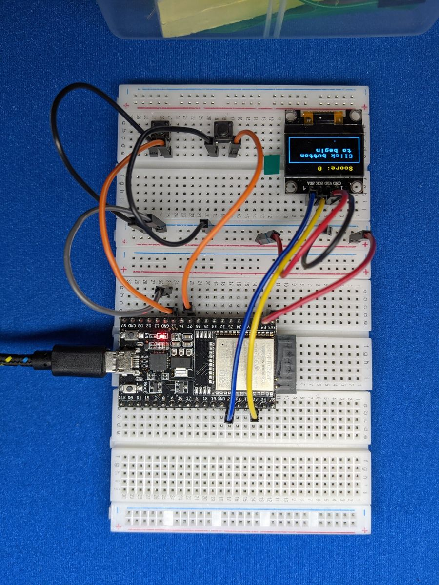

---
hide:
  - navigation
  - toc
---

# Learn electronics by building things that work.

CircuitCoder is a free, hands-on guide to programming microcontrollers. You'll
wire up real components to an **ESP32** board, write **MicroPython** code to
control them, and combine them into projects you'll actually want to show
people: a Snake game, a Wi-Fi alarm clock, a motion alarm that pings your phone.

No experience needed. If you can install an app and follow along, you can do this.

[Get started :material-arrow-right:](getting-started/index.md){ .md-button .md-button--primary }
[See the projects](projects/index.md){ .md-button }

## What you'll learn

Each component gets its own short lesson: how it works, how to wire it, and
the code to control it.

  <a href="components/leds/">LEDs</a>
  <a href="components/buttons/">Buttons</a>
  <a href="components/potentiometers/">Potentiometers</a>
  <a href="components/buzzers/">Buzzers</a>
  <a href="components/servos/">Servo Motors</a>
  <a href="components/oled/">OLED Screens</a>
  <a href="components/motion-sensors/">Motion Sensors</a>
  <a href="components/wifi/">Wi-Fi & APIs</a>

## What you'll build

  
  
  
  

- **Music Machine**: a button and a knob turn a buzzer into an instrument.
- **Servo Controller**: steer a motor with a dial or a pair of buttons.
- **Etch-a-Sketch**: draw on a tiny screen with two knobs.
- **Snake**: the classic game, on a screen you wired up yourself.
- **Fortune Teller**: a motorised spinner that decides your fate.
- **Motion Alert**: get a notification on your phone when someone walks by.
- **Alarm Clock**: sets its own time from the internet, with a timer and stopwatch.

## How the guide works

1. **[Get set up](getting-started/index.md).** Install one free app (Thonny),
   put MicroPython on your board, and blink your first LED. About 20 minutes.
2. **[Learn just enough Python](python/index.md).** Variables, lists, loops
   and functions: the handful of ideas you'll use in every project.
3. **[Meet the components](components/index.md).** One at a time, each with a
   circuit to build and code to try.
4. **[Build the projects](projects/index.md).** Combine what you've learned
   into bigger builds, each one a step up from the last.

All of the code is free on
[GitHub](https://github.com/CircuitCoder-ngh/MicroPythonStarterGuide), and
every example on this site has a copy button.
