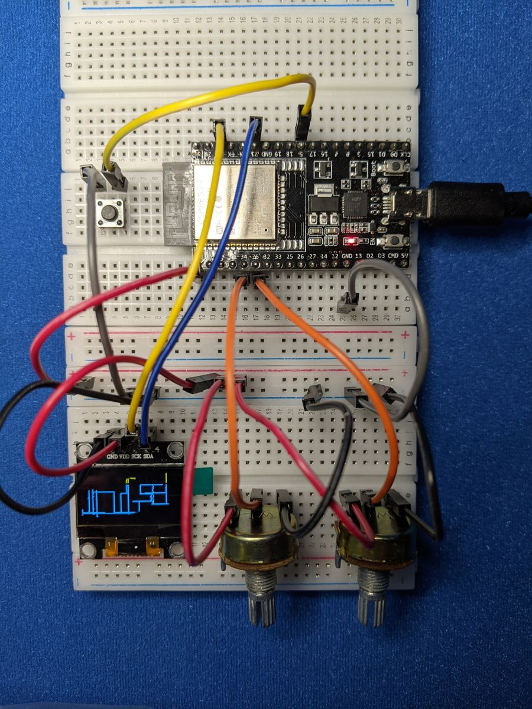
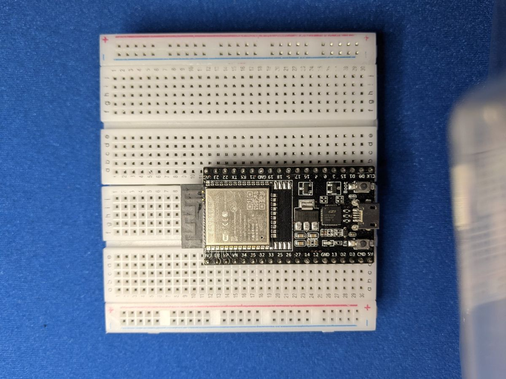

# Project: Etch-a-Sketch


Ever used an Etch-a-Sketch? Now you'll build a digital one. Two dials move
a pen around the OLED screen, one button lifts the pen so you can move
without drawing, and another shakes the screen clean.

{ .cc-photo width="380" loading=lazy }

*Photo from the first edition. Follow the wiring table for pin numbers.*

## Objective

- **Potentiometer 1** moves the pen left and right.
- **Potentiometer 2** moves the pen up and down.
- **Button A** lifts the pen up or puts it back down. While it's up, a
  blinking dot shows where you are.
- **Button B** clears the screen.

<div class="cc-parts" markdown>
**You'll need:**

- [x] 1 × SSD1306 OLED screen (128 × 64, I2C)
- [x] 2 × potentiometers
- [x] 2 × push buttons
- [x] Jumper wires
</div>

!!! note "Before you start"
    This project builds on [OLED Screens](../components/oled.md),
    [Potentiometers](../components/potentiometers.md) and
    [Buttons](../components/buttons.md). Make sure **`button.py`** and
    **`ssd1306.py`** are saved on your ESP32 (see
    [Saving Programs to the Board](../getting-started/saving-programs.md)).

## Wiring

This project needs pins on both sides of the ESP32. Clip two breadboards
together and sit the ESP32 across the gap, so both rows of pins have free
holes next to them:

{ .cc-photo width="360" loading=lazy }

| Part | Pin | Connects to |
|---|---|---|
| OLED | GND | **GND** |
| | VCC | **3V3** |
| | SCL | GPIO **22** |
| | SDA | GPIO **21** |
| Potentiometer 1 (X) | outer legs | **3V3** and **GND** |
| | middle leg | GPIO **34** |
| Potentiometer 2 (Y) | outer legs | **3V3** and **GND** |
| | middle leg | GPIO **35** |
| Button A (pen) | one leg | GPIO **14**, other leg to **GND** |
| Button B (clear) | one leg | GPIO **25**, other leg to **GND** |

!!! tip
    If a dial moves the pen the "wrong" way, swap the 3V3 and GND wires on
    its two outer legs. Nothing in the code needs to change.

## Plan it out

1. **Set up each component:** two ADC inputs, two buttons and the OLED
   screen over I2C.
2. **Break the job into functions.**
    - `read_smooth(pot)` averages a handful of readings to steady the
      pen.
    - `read_position()` turns the two dial readings into an (x, y) point on
      the screen.
    - `show_cursor()`, `hide_cursor()` and `blink_cursor()` handle the
      blinking dot while the pen is up.
3. **Main loop:** check the buttons, read the dials, and draw a line from
   the last point to the new one.

## Code

Save this to your ESP32 as **`main.py`**, or click **Run** in Thonny.

```python title="etch_a_sketch.py"
--8<-- "projects/etch_a_sketch.py"
```

## How it works

### From dial to pixel

The screen is 128 pixels wide and 64 tall. Just like in the Music Machine,
the code maps each dial's 0–65535 reading onto that range:

```python
x = read_smooth(pot_x) * (WIDTH - 1) // 65535
```

On the OLED, **(0, 0) is the top-left corner**, and y gets bigger as you go
*down*. That feels backwards when you're turning a dial, so the code flips
it with `(HEIGHT - 1) - ...`. Turning Potentiometer 2 up moves the pen up.

### Drawing lines, not dots

If the dial moves quickly, the pen can jump several pixels between two
readings. Drawing single dots would leave gaps, so instead the code draws
a **line** from the previous point to the new one with `display.line()`.
`last_x, last_y = x, y` then remembers the new point for next time.

### A cursor that doesn't damage your drawing

While the pen is up, the cursor blinks by flipping one pixel. Before
drawing it, `show_cursor()` remembers what was underneath
(`display.pixel(x, y)` with no colour *reads* a pixel). `hide_cursor()`
puts it back exactly as it was, so the cursor never rubs out any of
your lines.

## Result

Turn the dials to draw, press Button A to hop to a new spot without leaving
a trail, and Button B to start over. You can also press the ESP32's **EN**
(reset) button to clear the screen.

## Make it your own

- **Save your art:** keep a list of every point you draw and replay the
  drawing on start-up.
- **Eraser mode:** add Button C (GPIO 32) to switch between drawing white
  (colour `1`) and erasing (colour `0`).
- **Shape stamps:** use `display.rect()` or `display.ellipse()` to stamp a
  shape at the cursor when you press a button.
