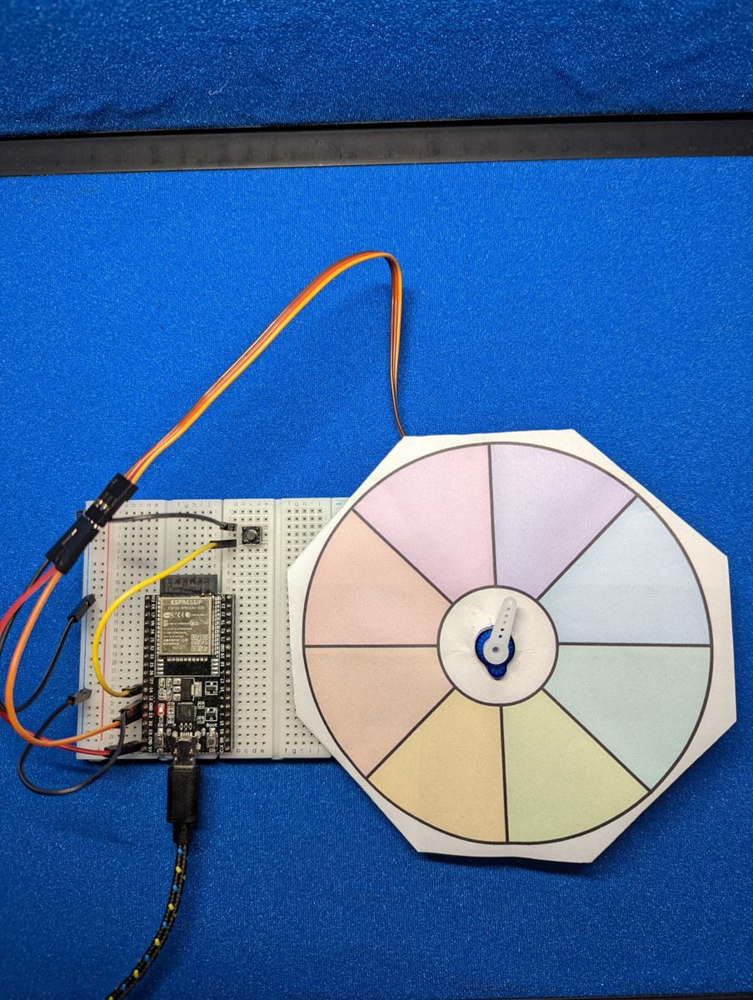

# Project: Fortune Teller


Ask a yes-or-no question, press the button, and watch the pointer swing
wildly across the wheel, slow down… and land on your fate. It's a
magic 8-ball you built yourself.

{ .cc-photo width="380" loading=lazy }

*Photo from the first edition, which used a full-circle wheel. Follow the
wiring table for pin numbers.*

## Objective

Press **Button A** and the servo sweeps back and forth for a random 2–6
seconds, gradually slowing down. Then it lands on one of six slices of a
paper wheel. The buzzer ticks every time the pointer crosses into a new
slice, and the chosen fortune is printed in Thonny's Shell.

<div class="cc-parts" markdown>
**You'll need:**

- [x] 1 × servo motor (SG90 or similar) with a pointer-shaped arm
- [x] 1 × push button
- [x] 1 × passive piezo buzzer (optional, for tick sounds)
- [x] The printable wheel (below), scissors, and tape
- [x] Jumper wires
</div>

!!! note "Before you start"
    This project builds on [Servo Motors](../components/servos.md),
    [Buttons](../components/buttons.md) and
    [Piezo Buzzers](../components/buzzers.md). Make sure **`button.py`** is
    saved on your ESP32 (see [Saving Programs to the Board](../getting-started/saving-programs.md)).

## Make the wheel

A standard servo turns through 180°, so the wheel is a half-circle split
into six slices of 30°.

[:material-download: Download the printable wheel (SVG)](../assets/img/diagrams/fortune-wheel-half.svg){ .md-button download="fortune-wheel-half.svg" }

1. Print it at **100 % scale** (don't "fit to page").
2. Write a fortune in each slice. They're numbered 1–6, matching the
   `FORTUNES` list in the code. Or use them as a dice, a chore picker,
   or a "who goes first?" spinner.
3. Cut along the dashed line and poke a hole where the servo shaft goes.
4. Slide the wheel over the servo's shaft, then push the arm back on and
   tape the wheel to the servo body so it can't turn.

!!! tip "Lining up the pointer"
    When the code starts, it moves the servo to the middle of slice 1 (15°).
    Run it once *before* attaching the arm, then push the arm on so it
    points into slice 1. If the pointer runs the "wrong way" around the
    wheel, just flip the order of the fortunes in the list.

## Wiring

| Part | Wire / leg | Connects to |
|---|---|---|
| Servo | brown or black (ground) | **GND** |
| | red (power) | **VIN** (5 V) |
| | orange or yellow (signal) | GPIO **13** |
| Button A | one leg | GPIO **14**, other leg to **GND** |
| Buzzer (optional) | + leg | GPIO **26** |
| | – leg | **GND** |

## Plan it out

1. **Set up each component:** the servo and buzzer are PWM outputs, and
   the button comes from `button.py`.
2. **Break the job into functions.**
    - `set_angle(angle)` points the servo.
    - `tick()` makes a very short click on the buzzer.
    - `spin()` sweeps back and forth, slowing down, for a random time.
    - `land(from_angle)` picks a random fortune and glides to the middle
      of its slice.
3. **Main loop:** wait for a button press, then spin, land and announce the
   fortune.

## Code

Save this to your ESP32 as **`main.py`**, or click **Run** in Thonny.

```python title="fortune_teller.py"
--8<-- "projects/fortune_teller.py"
```

## How it works

### Slowing down

Every 20 ms, `spin()` moves the pointer by `step` degrees, and `step` shrinks
as time runs out:

```python
step = 10 - 9 * elapsed // spin_time
```

At the start `elapsed` is 0, so `step` is 10°. By the end, `elapsed` is
almost `spin_time`, so `step` is down to 1°. When the pointer reaches 0° or
180° it flips `direction` and bounces back the other way.

### Landing on a slice

The pointer isn't *really* stopped by luck: `land()` picks a random fortune
with `random.randint()`, works out the angle at the middle of its slice
(15°, 45°, 75°, …), and glides there one degree at a time. It looks like
fate, but it's fair: every fortune has an equal 1-in-6 chance.

### Ticking

`angle // SLICE_SIZE` tells you which slice the pointer is in (`//` is
whole-number division). If that number changes between one move and the
next, the pointer just crossed a line, so the buzzer clicks.

## Result

<div class="cc-gallery">


</div>

*Photos from the first edition. Follow the wiring table for pin numbers.*

!!! tip "Got a continuous-rotation servo?"
    A **continuous-rotation** (360°) servo, such as the FS90R, spins round
    and round instead of turning to an angle. With one of those you can
    use the first edition's
    [full-circle wheel](../assets/img/diagrams/fortune-wheel.png) instead.
    Set a pulse width a little away from 1.5 ms to spin (for example
    `servo.duty_ns(1_300_000)`), wait a random 2–6 seconds, then stop the
    servo with `servo.duty_ns(1_500_000)`.

## Make it your own

- **Show it on screen:** add the OLED and display the fortune in text
  when the pointer lands.
- **Drum roll:** play a rising tone on the buzzer during the spin and a
  "ta-da!" when it lands.
- **Weighted fortunes:** make some answers more likely than others by
  listing them twice in `FORTUNES` (you'll need more slices on your wheel!).
