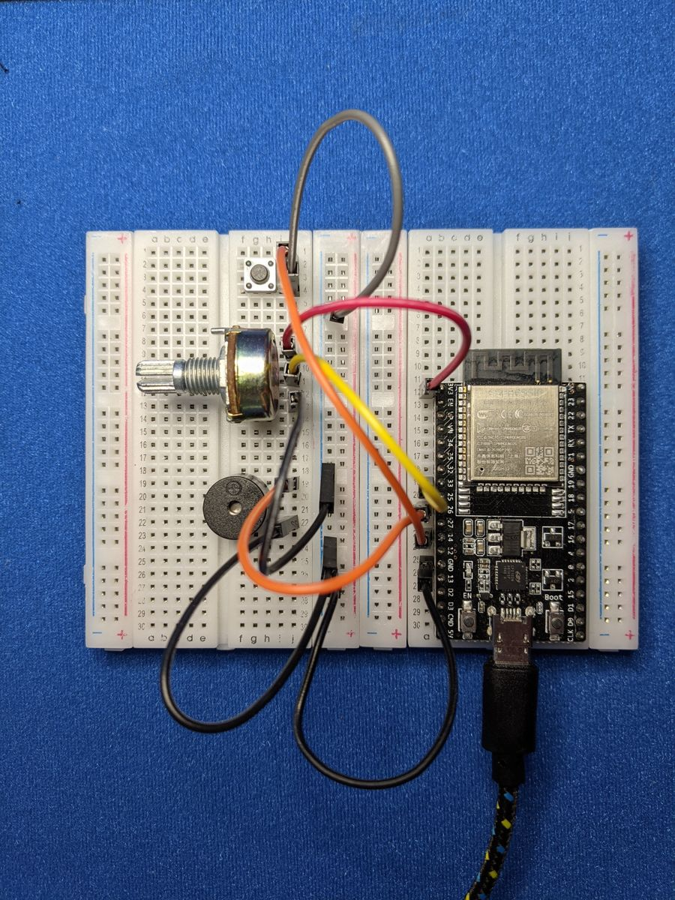
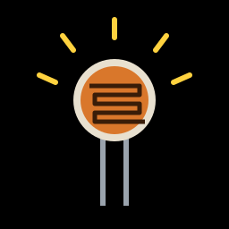
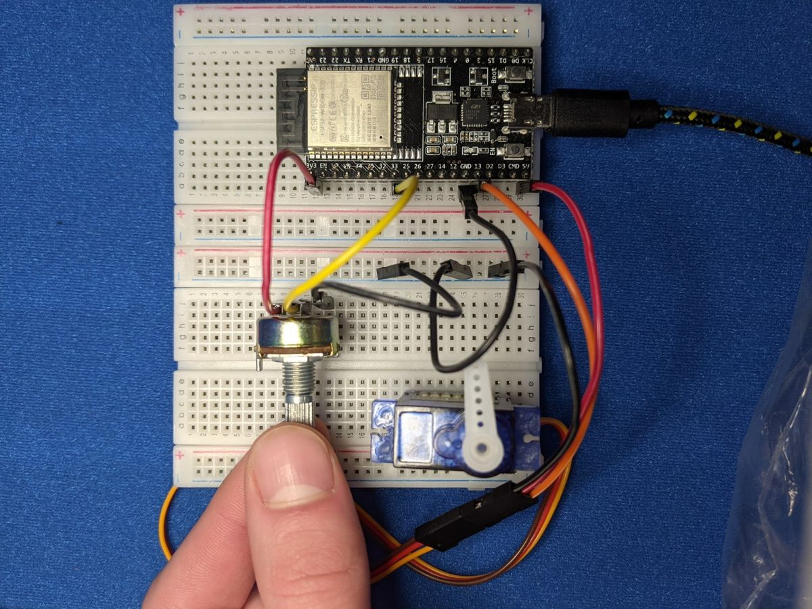
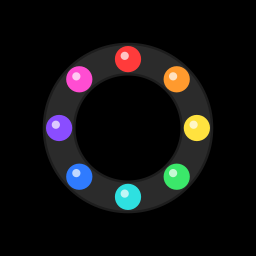
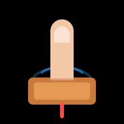
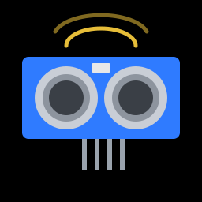
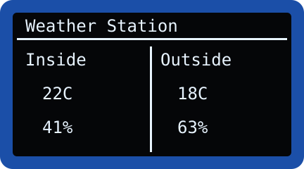
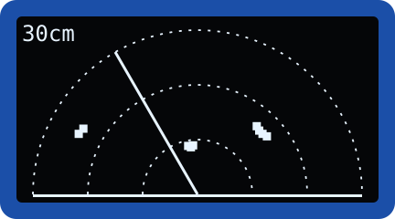
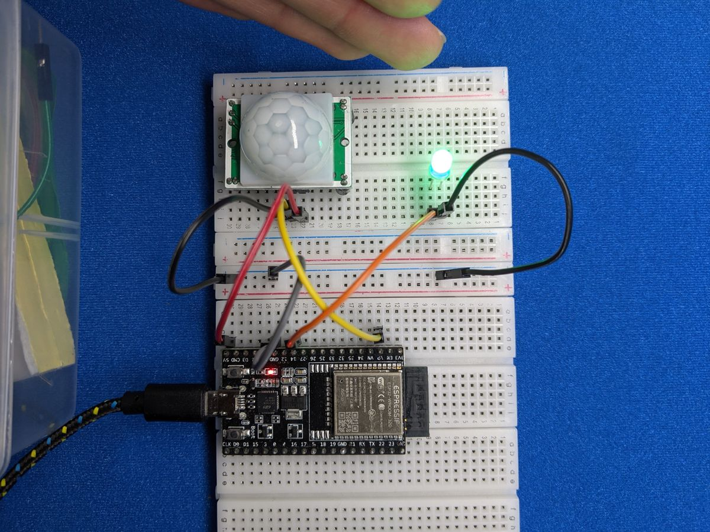
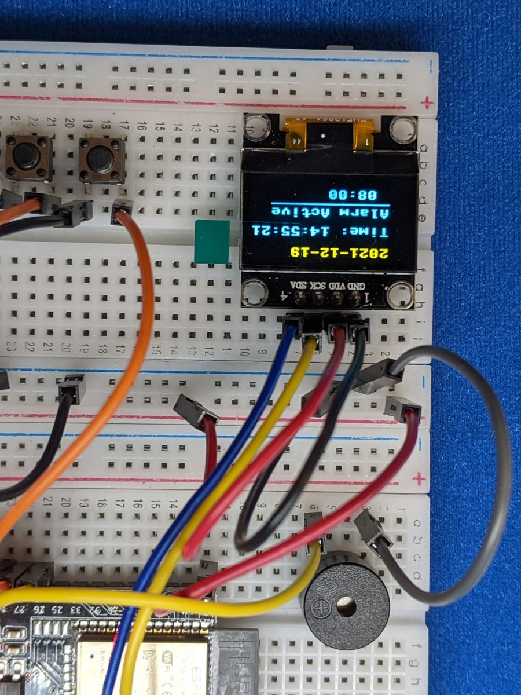

# Projects

Time to put the pieces together. Each project combines a few of the
components you've learned about into something you can actually play with,
show off, or use every day.

They're listed roughly from easiest to hardest. Every project page includes
the wiring, a plan, the full code and ideas for making it your own.

!!! tip "Before you start"
    Work through the [Components](../components/index.md) lessons first.
    Every project assumes you know how to wire and code the parts it uses,
    and how to [save a program to the board](../getting-started/saving-programs.md).

-   { .cc-photo loading=lazy }

    **[Music Machine](music-machine.md)**

    Turn a dial to bend the pitch of a buzzer, and tap a button to start and stop.

    ⭐ · Button, Potentiometer, Buzzer

-   { .cc-photo loading=lazy }

    **[Light Theremin](light-theremin.md)**

    Wave your hand over a light sensor to play spooky theremin music.

    ⭐ · Light Sensor, Buzzer, Button

-   { .cc-photo loading=lazy }

    **[Servo Controller](servo-controller.md)**

    Steer a servo motor with a dial, or nudge it precisely with two buttons.

    ⭐ · Servo, Potentiometer, Buttons

-   { .cc-photo loading=lazy }

    **[Night Light](night-light.md)**

    A colour-changing lamp that switches itself on when the room gets dark.

    ⭐⭐ · NeoPixels, Light Sensor, Touch

-   { .cc-photo loading=lazy }

    **[Etch-a-Sketch](etch-a-sketch.md)**

    Two dials, one screen: build your own digital drawing toy.

    ⭐⭐ · OLED, 2 Potentiometers, 2 Buttons

-   { .cc-photo loading=lazy }

    **[Touch Piano](touch-piano.md)**

    Turn foil, coins or bananas into piano keys with the ESP32's touch pins.

    ⭐⭐ · Touch, Buzzer, NeoPixels (optional)

-   { .cc-photo loading=lazy }

    **[Parking Sensor](parking-sensor.md)**

    Beeps faster and glows redder as something gets closer, just like a car.

    ⭐⭐ · Ultrasonic, RGB LED, Buzzer

-   { .cc-photo loading=lazy }

    **[Weather Station](weather-station.md)**

    Compare the temperature inside with the weather outside, live from the internet.

    ⭐⭐⭐ · Temperature, OLED, Button, Wi-Fi

-   { .cc-photo loading=lazy }

    **[Snake Game](snake.md)**

    The classic arcade game on a tiny screen: eat apples, grow longer, don't crash.

    ⭐⭐ · OLED, 2 Buttons

-   { .cc-photo loading=lazy }

    **[Fortune Teller](fortune-teller.md)**

    Ask a question, press the button, and let the spinning pointer decide your fate.

    ⭐⭐ · Servo, Button, Buzzer (optional)

-   { .cc-photo loading=lazy }

    **[Sonar Radar](sonar-radar.md)**

    A servo sweeps an ultrasonic sensor and the OLED draws what it sees.

    ⭐⭐⭐ · Servo, Ultrasonic, OLED

-   { .cc-photo loading=lazy }

    **[Motion Alert](motion-alert.md)**

    Get a notification on your phone whenever someone walks past.

    ⭐⭐ · Motion Sensor, LED, Wi-Fi

-   { .cc-photo loading=lazy }

    **[Alarm Clock](alarm-clock.md)**

    The capstone: a clock that sets itself from the internet, plus an alarm, stopwatch and timer.

    ⭐⭐⭐ · OLED, 3 Buttons, Buzzer, Wi-Fi

## Next: build a robot

Finished the projects? The [Robot](../robot/index.md) section puts
everything together in a two-wheeled robot that drives, dodges obstacles,
follows lines and takes orders from your phone.

[Meet the robot :material-arrow-right:](../robot/index.md){ .md-button .md-button--primary }
