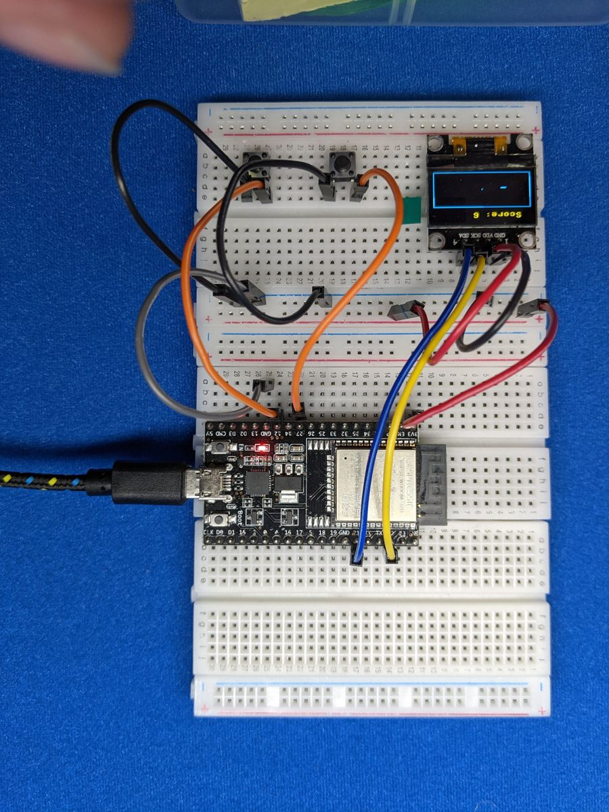

# Project: Snake Game


Recreate the classic arcade game on your OLED screen! Steer the snake with
two buttons, eat the apples to grow longer, and try not to crash into the
walls or your own tail. It speeds up as your score goes up.

{ .cc-photo width="380" loading=lazy }

*Photo from the first edition. Follow the wiring table for pin numbers.*

## Objective

- **Button A** turns the snake 90° to its *left*.
- **Button B** turns the snake 90° to its *right*.
- Each apple you eat makes the snake one square longer and adds a point.
- Hitting a wall or the snake's own body ends the game.

The turns are **relative to the way the snake is heading**, not fixed
up/down/left/right. So if the snake is heading down the screen, "left"
sends it to *your* right. It takes a minute to get used to. That's part of
the fun!

<div class="cc-parts" markdown>
**You'll need:**

- [x] 1 × SSD1306 OLED screen (128 × 64, I2C)
- [x] 2 × push buttons
- [x] Jumper wires
</div>

!!! note "Before you start"
    This project builds on [OLED Screens](../components/oled.md) and
    [Buttons](../components/buttons.md). Make sure **`button.py`** and
    **`ssd1306.py`** are saved on your ESP32 (see
    [Saving Programs to the Board](../getting-started/saving-programs.md)).

## Wiring

| Part | Pin | Connects to |
|---|---|---|
| OLED | GND | **GND** |
| | VCC | **3V3** |
| | SCL | GPIO **22** |
| | SDA | GPIO **21** |
| Button A (turn left) | one leg | GPIO **14**, other leg to **GND** |
| Button B (turn right) | one leg | GPIO **25**, other leg to **GND** |

!!! tip
    Put Button A on the left and Button B on the right of your breadboard.
    Your fingers will thank you.

## Plan it out

A game is just a loop that does three things over and over: **read input,
update the game, draw the screen**.

1. **Set up the components and the game world.** The screen is split into
   a 16-pixel score bar and a play area. The play area is a grid of 4 × 4
   pixel squares, 32 across and 12 down. The snake is a list of the
   squares it covers.
2. **Break the job into functions.**
    - `new_game()` resets the snake, score and speed.
    - `place_apple()` picks a random empty square.
    - `check_buttons()` turns the snake.
    - `move_snake()` moves the head forward one square, checks for crashes
      and apples, and removes the tail unless the snake just ate.
    - `draw_game()` and `show_message()` draw everything.
3. **Main loop:** show a start screen, run the game until you crash, show
   your score, and repeat.

## Code

Save this to your ESP32 as **`main.py`**, or click **Run** in Thonny.

```python title="snake.py"
--8<-- "projects/snake.py"
```

## How it works

### The snake is a list

`snake` holds `(column, row)` pairs, with the **head at the end** of the
list. Moving is a neat trick: add a new head in front with `append()`, then
chop off the tail with `pop(0)`. The snake slides forward one square.
When it eats an apple, the code simply *skips* removing the tail, so the
snake grows by one.

### Turning with a list of directions

```python
DIRECTIONS = [(0, -1), (1, 0), (0, 1), (-1, 0)]   # up, right, down, left
```

Each direction is how much the column and row change per move. They're in
**clockwise order**, so turning right just means moving to the next item in
the list, and turning left means going back one. The `% 4` wraps around the
ends: from "left" (3), turning right gives `(3 + 1) % 4 = 0`, which is "up".

The code only allows **one turn per move**. Otherwise, two quick taps
could spin the snake straight back into its own neck.

### Timing without `sleep()`

If the loop slept for the whole time between moves, button presses during
that time could be missed. Instead, the loop runs quickly and checks the
buttons every time around. It only moves the snake once `speed_ms`
milliseconds have passed since the last move:

```python
if time.ticks_diff(time.ticks_ms(), last_move) >= speed_ms:
```

Each apple knocks 10 ms off `speed_ms`, down to a limit of 80 ms, so the
game gets faster as you get better.

## Result

<div class="cc-gallery">


</div>

*Photos from the first edition. Follow the wiring table for pin numbers.*

## Make it your own

- **High score:** keep the best score in a variable and show it on the
  game-over screen. For a real challenge, save it to a file so it survives
  a restart.
- **Sound effects:** add the buzzer on GPIO 26 and play a quick beep when
  you eat an apple, and a sad low tone when you crash.
- **Wrap-around walls:** instead of crashing into a wall, make the snake
  come out the opposite side (hint: `%` again!).
- **Four-button controls:** add Buttons C and D for fixed up/down/left/right
  controls instead of relative turns.
