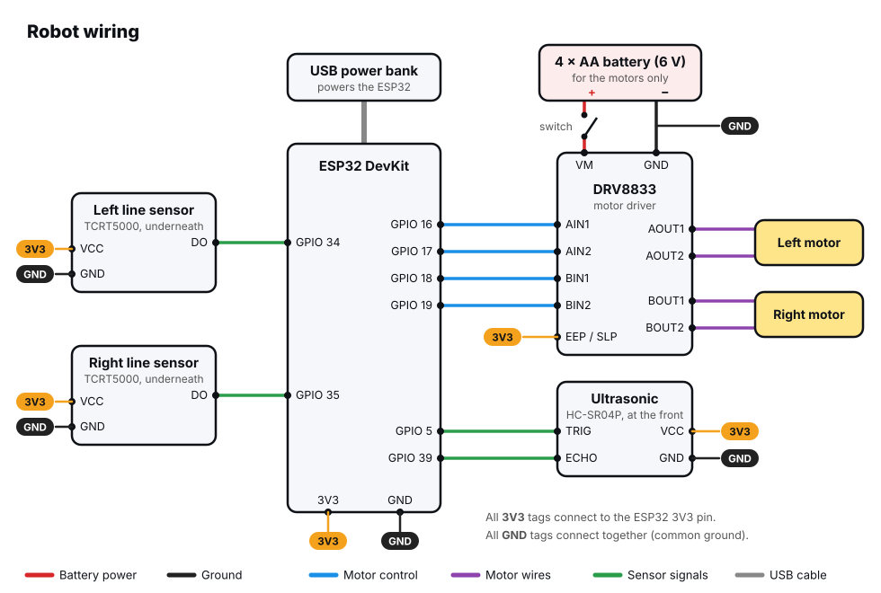

# Build the Robot


Time to build! In this step you'll assemble the chassis, mount the
electronics, wire everything together, and check that each wheel turns the
right way. Take your time. A neat, solid build saves a lot of head-scratching
later.

<div class="cc-parts" markdown>
**You'll need:**

- [x] Everything in the [parts list](index.md#what-youll-need)
- [x] A small Phillips screwdriver
- [x] Double-sided foam tape or a few zip ties
</div>

## 1. Assemble the chassis

Every chassis kit is slightly different, so keep your kit's instructions
handy. The usual order is:

1. **Motors.** Each TT motor is held to the underside of the base plate by
   two small acrylic brackets and two long screws. Point the motor shafts
   **outwards**, and make sure the two motors mirror each other.
2. **Wheels.** Push a wheel onto each motor shaft. The shaft has flat sides,
   so line them up with the slot in the wheel and press firmly.
3. **Caster.** Screw the small swivelling caster wheel to the other end of
   the base plate using the brass spacers, so the robot sits level.
4. **Battery holder.** Mount the 4 × AA holder on top (or underneath) with
   screws or double-sided tape. Put it near the middle, so the robot doesn't
   tip.

The end with the caster is the **back** of the robot, and the end with the
motors is the **front**. (Some builders do it the other way around. It works
either way, but this guide assumes the motors are at the front.)

!!! tip "Speed-sensor discs"
    Many kits include two slotted plastic discs that fit on the motor shafts.
    They're for speed sensors, which this guide doesn't use. You can leave
    them off.

## 2. Mount the electronics

- **Breadboard:** stick a half-size breadboard on top of the base plate
  using the tape on its back. Press the **ESP32** and the **DRV8833** into
  it.
- **Ultrasonic sensor:** mount it at the **front**, facing forwards, with a
  bit of tape or a bracket. Make sure nothing on the robot is in front of its
  two "eyes".
- **Line sensors:** mount both modules **underneath** the front of the
  robot, facing down, about **2 cm apart** and **5–10 mm above the floor**.
  They should straddle the tape: when the robot is centred on the line, the
  tape should run *between* them. Zip ties through the base plate's slots
  work well.
- **Power bank:** strap it on with tape or a rubber band, near the ESP32 so
  the USB cable reaches.

!!! note "No photos yet"
    Photos of the finished build are coming soon. In the meantime, the
    wiring diagram below shows every connection.

## 3. Power: two supplies, one ground



The robot has **two separate power supplies**:

| Supply | Powers | Connected to |
|---|---|---|
| 4 × AA battery pack (about 6 V) | The **motors**, through the DRV8833 | DRV8833 **VM** and **GND** only |
| USB power bank (5 V) | The **ESP32** and the sensors | ESP32 USB socket |

While you're programming, the ESP32 is powered by your computer's USB cable
instead of the power bank. Swap to the power bank when it's time to drive
around untethered.

!!! danger "Never power the motors from the ESP32"
    The ESP32's 3V3 and VIN pins can't supply enough current for two motors.
    Trying it will make the board restart constantly, or damage its
    regulator. Motor power **only** comes from the battery pack.

### Why the grounds must be connected

The ESP32 tells the DRV8833 what to do by setting its pins to 3.3 V or 0 V.
But "3.3 V" only means something **compared to** a 0 V reference. If the
battery pack's ground and the ESP32's ground aren't connected, the driver has
no shared reference to measure the ESP32's signals against, and the motors
will do nothing (or behave randomly).

So the battery **–**, the DRV8833 **GND** and the ESP32 **GND** must all be
wired together. That's the **common ground** in the diagram. Every GND tag is
the same connection. The easiest way to do this is to use one of the
breadboard's **–** rails as a shared ground.

### Optional: a capacitor

If the ESP32 misbehaves when the motors start, add an electrolytic capacitor
(anywhere from 100 µF to 470 µF, rated 10 V or more) across the DRV8833's VM
and GND pins. Its **–** leg (marked with a stripe) goes to GND. It acts
like a tiny reservoir, smoothing out the sudden gulps of current as the
motors start.

## 4. Wire it up

With the battery pack switched **off**, make these connections, ticking them
off as you go:

| From | To |
|---|---|
| Battery **+** (through the switch) | DRV8833 **VM** |
| Battery **–** | DRV8833 **GND** |
| DRV8833 **GND** | ESP32 **GND** |
| DRV8833 **EEP / SLP** (if it has one) | ESP32 **3V3** |
| ESP32 **GPIO 16 / 17** | DRV8833 **AIN1 / AIN2** |
| ESP32 **GPIO 18 / 19** | DRV8833 **BIN1 / BIN2** |
| DRV8833 **AOUT1 / AOUT2** | **Left** motor's two wires |
| DRV8833 **BOUT1 / BOUT2** | **Right** motor's two wires |
| Ultrasonic **VCC / GND** | ESP32 **3V3 / GND** |
| Ultrasonic **TRIG / ECHO** | ESP32 **GPIO 5 / 39** |
| Left line sensor **VCC / GND / DO** | ESP32 **3V3 / GND / GPIO 34** |
| Right line sensor **VCC / GND / DO** | ESP32 **3V3 / GND / GPIO 35** |

"Left" and "right" are from the **robot's** point of view: stand behind it,
facing the same way it does.

!!! tip "Tidy wiring"
    Use short wires where you can, and bundle long ones with a small zip tie
    or tape. Loose wires snag on furniture, and get pulled into the wheels!

## 5. Test each wheel

Prop the robot up so its **wheels are off the ground**, switch the battery
pack on, and run:

```python title="wheel_test.py"
--8<-- "robot/wheel_test.py"
```

The **left** wheel should spin **forwards** for a second, then the **right**
wheel. Check each one:

| What you see | The fix |
|---|---|
| The wheel spins **backwards** | Swap that motor's two wires on the DRV8833. |
| The **right** wheel spins first | The motors are on the wrong outputs. Swap the AOUT and BOUT wire pairs. |
| A wheel doesn't spin at all | Check the battery switch, the common GND wire, the EEP/SLP pin, and that the motor wires are firmly in place. |
| The ESP32 restarts when a motor starts | Make sure the motors aren't powered from the ESP32, and try the capacitor. |

Run the test again until both wheels spin forwards, left then right. Your
robot is built!

!!! success "Copy the libraries"
    From now on, the robot programs need these library files saved on the
    ESP32: [`robot.py`](https://github.com/CircuitCoder-ngh/MicroPythonStarterGuide/blob/main/code/lib/robot.py),
    [`button.py`](https://github.com/CircuitCoder-ngh/MicroPythonStarterGuide/blob/main/code/lib/button.py)
    and [`distance.py`](https://github.com/CircuitCoder-ngh/MicroPythonStarterGuide/blob/main/code/lib/distance.py).
    See [Copy library files to the board](../getting-started/saving-programs.md#copy-library-files-to-the-board).

!!! tip "Choosing a power bank"
    Some power banks switch themselves off after a few seconds if very
    little current is being drawn, and an ESP32 draws very little. If yours
    keeps turning off, look for one with an "always on" or "low current"
    mode (often a double press of its button). Keeping Wi-Fi switched on, as
    the remote control program does, also draws enough to keep most banks
    awake.

**Next up:** make it move. [First Drive](driving.md).
