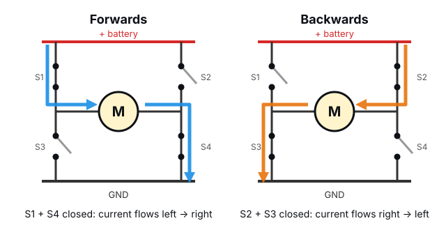

# DC Motors


Servos turn to an angle. **DC motors** just spin, round and round, as long as
they have power. They're the muscles in everything from toy cars to electric
bikes, and they'll drive your robot's wheels. In this lesson you'll wire up
**one motor on your desk** and control its speed and direction from code.

<div class="cc-parts" markdown>
**You'll need:**

- [x] 1 × TT gear motor (the yellow ones from the chassis kit)
- [x] 1 × DRV8833 motor driver module
- [x] The 4 × AA battery holder with batteries
- [x] Jumper wires
</div>

## How a DC motor works

Inside a DC motor are magnets and coils of wire. Push current through the
coils and they become electromagnets, which push against the fixed magnets
and make the shaft spin. Two simple rules:

- **More voltage → faster.**
- **Reverse the current → it spins the other way.**

A bare motor spins very fast (thousands of turns a minute) but with hardly
any force. The yellow **TT motor** has a **gearbox** built in: a chain of
plastic gears that trades speed for strength. The wheel turns slower, but
with enough force to push a robot around. That speed-for-force trade is
the same reason bikes have gears.

## Why you can't plug a motor into a GPIO pin

An ESP32 pin can safely supply about 20 mA. A TT motor needs **100–250 mA**
while running, and even more (up to around 1 A) for a split second when it
starts or gets stuck. Connecting one straight to a pin would, at best, not
work, and at worst damage the ESP32.

There's a second problem too: a pin can only switch between 3.3 V and 0 V,
so it can't **reverse** the current to make the motor go backwards.

The solution is a **motor driver**: a chip that takes small signals from the
ESP32 and uses them to switch the big current from a battery.

## The H-bridge

Inside the motor driver is a circuit called an **H-bridge**: four switches
arranged in an H shape, with the motor in the middle.



- Close **S1 and S4**, and current flows through the motor left to right: it
  spins **forwards**.
- Close **S2 and S3**, and the current flows right to left: it spins
  **backwards**.
- Open them all, and the motor **coasts** to a stop.

(Closing S1 and S3 together would connect the battery straight to ground: a
short circuit! Driver chips are designed so that can't happen.)

The switches in a real H-bridge are transistors, which can switch on and off
thousands of times a second. That's what lets us use **PWM** to control
speed, just like dimming an LED.

## The DRV8833 motor driver

The DRV8833 module has **two** H-bridges, one per motor, which is exactly
what a two-wheeled robot needs. It runs from 2.7–10.8 V, so a 4 × AA pack
(about 6 V) is perfect.

Each motor is controlled by two input pins:

| IN1 | IN2 | Motor |
|:-:|:-:|---|
| 0 | 0 | Coasts (off) |
| **PWM** | 0 | Forwards, speed set by the PWM duty |
| 0 | **PWM** | Backwards, speed set by the PWM duty |
| 1 | 1 | Brakes (stops sharply) |

!!! info "Pin names vary"
    Different DRV8833 boards label their pins differently. **AIN1/AIN2** may be
    printed as **IN1/IN2**, and **AOUT1/AOUT2** as **AO1/AO2** or
    **OUT1/OUT2**. The B pins (or IN3/IN4, OUT3/OUT4) control the second
    motor. **VM** is sometimes labelled **VCC**. Some boards also have an
    **EEP**, **SLP** or **STBY** pin that must be connected to 3V3 to switch
    the driver on.

## Hardware

!!! warning "Do your motors have wires?"
    Some chassis kits come with motors that have wires already attached, and
    some come with just two metal tabs, which need wires **soldered** on. If
    yours need soldering and you don't have a soldering iron, a local
    makerspace, school or hobby club can usually help. Or buy TT motors with
    "pre-soldered wires" (they're very cheap).

Wire up one motor on the breadboard, with the battery pack switched **off**:

| From | To |
|---|---|
| Battery pack **+** (red) | DRV8833 **VM** |
| Battery pack **–** (black) | DRV8833 **GND** |
| DRV8833 **GND** | ESP32 **GND** (the grounds must be connected!) |
| DRV8833 **AIN1** | ESP32 **GPIO 16** |
| DRV8833 **AIN2** | ESP32 **GPIO 17** |
| DRV8833 **AOUT1** and **AOUT2** | The two motor wires (either way round) |
| DRV8833 **EEP / SLP / STBY** (if it has one) | ESP32 **3V3** |

The ESP32 stays plugged into your computer by USB as usual.

!!! danger "Battery power goes to VM only"
    The battery pack must **only** connect to the driver's VM and GND pins,
    never to the ESP32's 3V3 or VIN pins. The ESP32 gets its power from USB.

## Software

### On, off and backwards

Before any fancy speed control, here's the truth table above in code. Switch
the battery pack on, then run:

```python title="motor_test.py"
--8<-- "robot/motor_test.py"
```

The motor should spin one way for two seconds, stop, then spin the other way.
If it doesn't move at all, check that the battery pack is switched on, that
the DRV8833's GND is connected to the ESP32's GND, and the EEP/SLP pin if
your board has one.

### Speed control with PWM

Instead of switching IN1 fully on, we can **pulse** it with PWM. The motor
only gets power for part of each pulse, so it runs slower. The duty cycle
sets the speed.

```python title="motor_ramp.py"
--8<-- "robot/motor_ramp.py"
```

- `set_motor(speed)` takes a number from **-100** (full reverse) to **100**
  (full forwards). The sign picks which input gets the PWM, and the size
  sets the duty.
- `freq=20_000` pulses the motor 20,000 times a second. At lower frequencies,
  motors make an annoying high-pitched whine. 20 kHz is above what people
  can hear.

Watch the motor as the speed ramps up: **nothing happens at first**. At low
duty cycles the motor doesn't get enough push to overcome the friction in the
gearbox, so it just hums. Most TT motors only start turning at about
**30–40 %**. Remember this; the robot library will deal with it for you.

### Try it in the REPL

Run `motor_ramp.py` once so `set_motor()` is defined, press Stop, then try
some speeds yourself:

```pycon
>>> set_motor(50)
>>> set_motor(-80)
>>> set_motor(0)
```

## Challenge

Wire a potentiometer to GPIO 34 (as in the
[Potentiometers](../components/potentiometers.md) lesson) and use it as a
throttle: centre = stopped, turn one way to go forwards, the other way to go
backwards.

??? example "Show a solution"

    Add this to the end of `motor_ramp.py`, in place of the ramps:

    ```python
    from machine import ADC

    pot = ADC(Pin(34), atten=ADC.ATTN_11DB)

    while True:
        reading = pot.read_u16()              # 0 to 65535
        speed = (reading - 32768) * 100 // 32768   # -100 to 100
        if abs(speed) < 10:
            speed = 0                         # a "dead zone" in the middle
        set_motor(speed)
        time.sleep_ms(50)
    ```

    The dead zone makes it easy to find "stopped". Without it, the motor
    would creep whenever the knob was slightly off-centre.

**Next up:** the robot's eyes for the floor, [Line Sensors](line-sensors.md).
