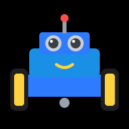

# Build a Robot

Everything so far has lived on your desk. Now it's time to build something
that **moves around on its own**. In this section you'll build a
two-wheeled robot car from a cheap chassis kit, wire it up to your ESP32, and
teach it, one step at a time, to:

- **drive** in patterns, and even dance,
- **see** obstacles with an ultrasonic sensor and steer around them,
- **follow a line** of black tape around a track, and
- take orders from your **phone over Wi-Fi**.

This is **mechatronics**: mechanical parts (motors, wheels, gears),
electronics (drivers, sensors, batteries) and code, all working together.
It's exactly how real robots work, from warehouse robots to robot vacuums
and Mars rovers. They're just bigger.

!!! note "Before you start"
    The robot uses skills from across the guide. You should be comfortable
    with [saving programs and library files to the board](../getting-started/saving-programs.md),
    [Buttons](../components/buttons.md), and ideally
    [Ultrasonic Sensors](../components/ultrasonic.md) and
    [Servo Motors](../components/servos.md).

## What you'll need

**Robot parts:**

- [x] **2WD robot car chassis kit.** These are sold under names like
      "2WD smart robot car chassis" and usually include: an acrylic base
      plate, 2 × yellow TT gear motors (3–6 V), 2 wheels, a caster wheel, a
      4 × AA battery holder with an on/off switch, and screws.
- [x] **DRV8833 dual motor driver** module
- [x] **HC-SR04P ultrasonic sensor**, the 3.3 V version. A classic 5 V
      HC-SR04 works too, but needs the voltage divider from the
      [Ultrasonic Sensors](../components/ultrasonic.md#which-sensor-do-you-have) lesson.
- [x] 2 × **TCRT5000 line-tracking** modules
- [x] Half-size breadboard
- [x] Jumper wires, male-to-male and male-to-female
- [x] 4 × AA batteries (rechargeable NiMH are fine)
- [x] A small **USB power bank** and a short USB cable
- [x] Your ESP32 DevKit board

**Optional extras:**

- [x] SG90 servo and a small bracket, for the scanning "head"
- [x] Piezo buzzer and a push button (you already have these)
- [x] Black electrical tape, for a line-following track

!!! tip "Why a power bank?"
    The robot uses **two** power supplies: the AA batteries drive the motors,
    and a USB power bank runs the ESP32. Motors are electrically "noisy" and
    can pull the battery voltage down when they start, which would make the
    ESP32 restart. Keeping them apart avoids that whole class of problem.
    [Build the Robot](build.md) explains how the two are connected.

## The robot's pin plan

| Part | GPIO | Notes |
|---|---|---|
| Left motor (DRV8833 AIN1 / AIN2) | 16 / 17 | |
| Right motor (DRV8833 BIN1 / BIN2) | 18 / 19 | |
| Ultrasonic sensor TRIG / ECHO | 5 / 39 | Same as the desk lessons |
| Left line sensor | 34 | |
| Right line sensor | 35 | |
| Servo (optional scanning head) | 13 | Same as the desk lessons |
| Buzzer (optional) | 26 | Same as the desk lessons |
| Start button (Button A) | 14 | Same as the desk lessons |

## The plan

Work through these pages in order. Each one adds one new skill, and ends with
something working.

| Step | Page | What happens |
|:-:|---|---|
| 1 | [DC Motors](dc-motors.md) | Spin a single motor on your desk, forwards, backwards, fast and slow. |
| 2 | [Line Sensors](line-sensors.md) | Learn how the robot can "see" a black line. |
| 3 | [Build the Robot](build.md) | Put the chassis together, wire everything up, and test each wheel. |
| 4 | [First Drive](driving.md) | Use the `robot.py` library to drive, turn, trace a square and dance. |
| 5 | [Obstacle Avoider](obstacle-avoider.md) | Let the robot roam and steer around anything in its way. |
| 6 | [Line Follower](line-follower.md) | Build a tape track and have the robot follow it. |
| 7 | [Wi-Fi Remote Control](remote-control.md) | Drive the robot from your phone. |

## Safety first

!!! warning "Batteries"
    - Only use the battery pack for the **motors**. Never connect it to the
      ESP32's 3V3 pin.
    - Don't mix old and new batteries, or rechargeable and non-rechargeable
      ones, in the same holder.
    - If anything gets hot or smells like burning, **switch the battery pack
      off** straight away and check the wiring for shorts.
    - Switch the battery pack off whenever you're not driving. The switch
      is there for a reason!

!!! tip "Testing on the desk"
    When you're trying out new code, prop the robot up on a small box or a
    roll of tape so its wheels spin in the air. It's much easier than
    chasing it off the edge of the table.

**Let's go:** start with [DC Motors](dc-motors.md).
